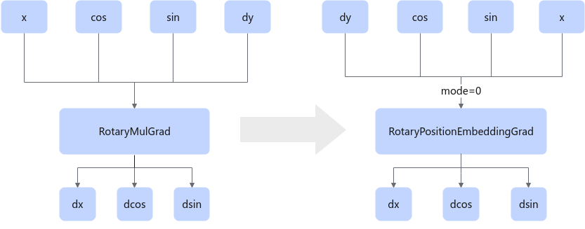
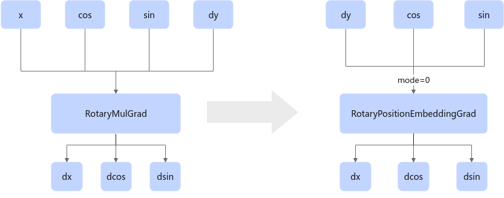

# RotaryMulGrad2RotaryPositionEmbeddingGradFusionPass

## Description

Fuses the RotaryMulGrad operator into the RotaryPositionEmbeddingGrad operator, as shown in the following fusion.

- needBackward == true

  

- needBackward == false

  

## Constraints

You are advised not to disable this pattern. Otherwise, the RotaryMulGrad Ascend IR function will be unavailable.

## Applicable Products

<!-- npu="950" id1 -->
950PR/950DT
<!-- end id1 -->
