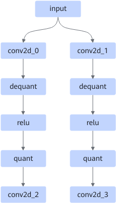
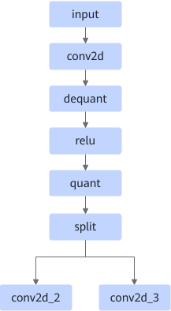

# SameInputConv2dFixpipePass

## Description

Fuses multiple Conv2D+AscendDequant+Relu+AscendQuant operators into one Conv2D+AscendDequant+Relu+AscendQuant+Split operator.

After:

## Constraints

- The specifications and attributes of the first Conv2D operator (conv2d_0 and conv2d_1 in the figure) of each channel must be the same, and the value of `output_channel` must be a multiple of 32.
- Only the static input shape (**fmap**, **filter**, **bias**) is supported.
- Only the first Conv2D groups of each channel can be 1.

## Applicable Products

<!-- npu="310b" id1 -->
Atlas 200I/500 A2 inference products
<!-- end id1 -->

<!-- npu="910b" id2 -->
Atlas A2 training products/Atlas A2 inference products
<!-- end id2 -->

<!-- npu="A3" id3 -->
Atlas A3 training products/Atlas A3 inference products
<!-- end id3 -->
