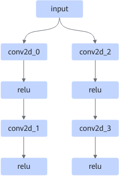
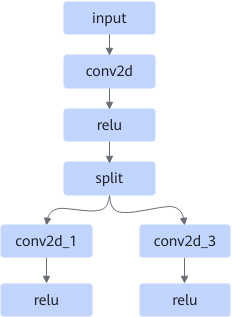
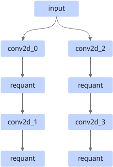
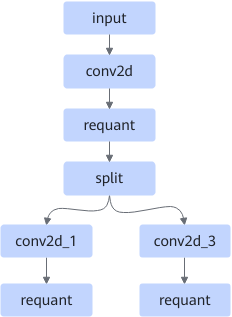
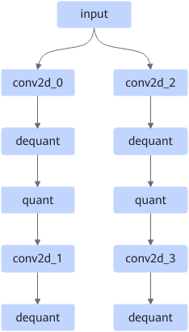
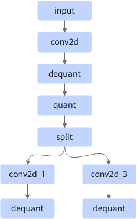

# SameInputConv2dPass

## Description

Non-quantization scenario: Fuses multiple parallel Conv2D+ReLU operators into one fused Conv2D+Relu+Split operator.

After:

Quantization scenario:

Fuses multiple Conv2D+AscendRequant composites into one Conv2D+AscendRequant+Split composite.

After:

Fuses multiple Conv2D+AscendDequant+AscendQuant composites into one Conv2D+AscendDequant+AscendQuant+Split composite.

After:

## Constraints

- Only the static input shape (**fmap**, **filter**, **bias**) is supported.
- Conv2D **groups** can only be **1**.
- The sum of filter batches of the first Conv2D operators (conv2d_0 and conv2d_2 in the figure) must be a multiple of 16. If the data type of **fmap** is int8, the sum of filter batches must be a multiple of 32.
- **filter** supports only the const, RequantHostCpuOp, ConvBnFilterHost, and AscendWeightQuant nodes.
- In non-quantization scenarios, the end nodes must be relu or conv2d.
- In quantization scenarios, the end nodes must be dequant, requant, or conv2d.

## Applicable Products

<!-- npu="310p" id1 -->
Atlas inference products
<!-- end id1 -->

<!-- npu="310b" id2 -->
Atlas 200I/500 A2 inference products
<!-- end id2 -->

<!-- npu="910" id3 -->
Atlas training products
<!-- end id3 -->
