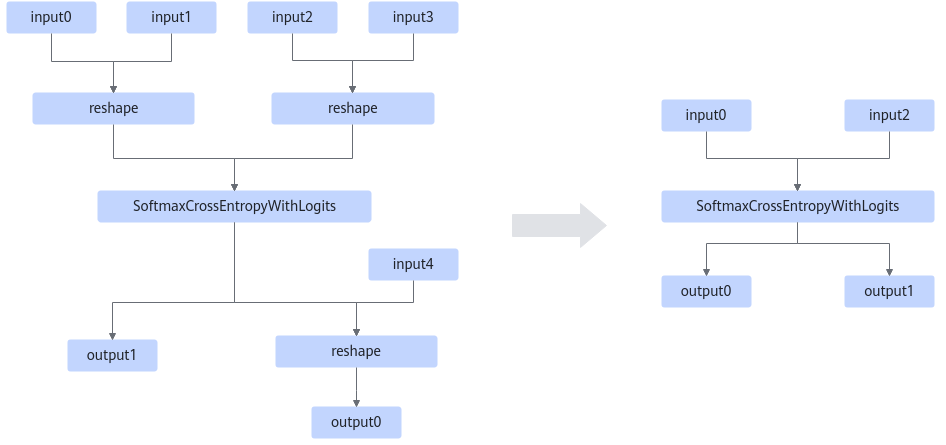

# SoftmaxCrossEntropyWithLogitsPass

## Description

Fuses the Reshape and SoftmaxCrossEntropyWithLogits operators that fit the graph fusion pattern, eliminating the Reshape operator and retaining only the SoftmaxCrossEntropyWithLogits operator.

## Constraints

- For the shape of input and output parameters:

    The shapes of input0, input2, and input4 must be 4D.

- For the format of input and output parameters:

    The formats of input0 and input2 must be NHWC, and the channel dimension C must be less than 131072.

- For the order of input parameters:
  - input0 and input2 must be the first inputs of Reshape.
  - The first output of SoftmaxCrossEntropyWithLogits must be the first input of Reshape.

- Performance description:

    The fusion pattern provides improved performance when the channel dimension C equals 1.

    If the performance deteriorates, disable this fusion pattern.

- For the data types of input parameters:

    The data types of input0 and input2 must be the same.

  <!-- npu="910b" id2 -->
  - Atlas A2 training products/Atlas A2 inference products: The data type can be FLOAT32 or BFLOAT16.
  <!-- end id2 -->

## Applicable Products

<!-- npu="910b" id1 -->
Atlas A2 training products/Atlas A2 inference products
<!-- end id1 -->
