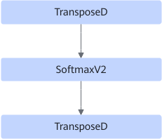

# SoftmaxFusionPass

## Description

Adds TransposeD operators to the input and output of SoftmaxV2.

Before:  After: 

## Constraints

- For input shapes:

    The input must be 3D or 5D.

  - For a 3D input, the last two dimensions of the input shape are `{8732, 21}`.
  - For a 5D input, the last four dimensions of the input shape are `{224, 224, 160, 4}`.

- For the size of input parameters:

    The size of input parameters (number of elements × dtype size) cannot exceed the maximum value of int32: 231-1.

- For input attributes:

    Only the first value of the **axes** attribute can be used to specify the last axis.

## Applicable Products
<!-- npu="A3" id1 -->
Atlas A3 training products/Atlas A3 inference products
<!-- end id1 -->

<!-- npu="910b" id2 -->
Atlas A2 training products/Atlas A2 inference products
<!-- end id2 -->

<!-- npu="310b" id3 -->
Atlas 200I/500 A2 inference products
<!-- end id3 -->

<!-- npu="310p" id4 -->
Atlas inference products
<!-- end id4 -->

<!-- npu="910" id5 -->
Atlas training products
<!-- end id5 -->
