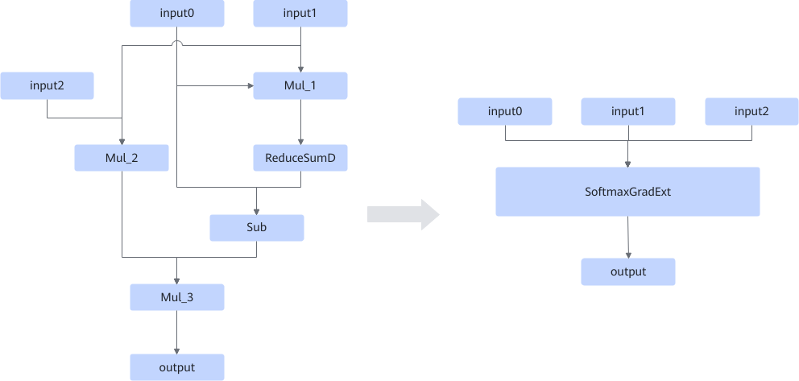

# SoftmaxGradExtFusion

## Description

Fuses the Mul, ReduceSumD, and Sub operators in the graph on the left that fit the graph fusion pattern into the SoftmaxGradExt operator in the graph on the right.

## Constraints

- For inputs:
  - The input of the Mul_1 node shares the same input0 as the first input of the Sub node.
  - The input of the Mul_1 node shares input1 with the input of the Mul_2 node.
  - `axis` of ReduceSumD must be `-1`, and `keep_dims` must be `True`.

- For data formats and shapes:
  - The shapes of input0 and input1 must fall within the range of 4D to 8D.
  - The last two dimensions of the shapes of input0 and input1 must be 16, and the data format must be NZ.
  - The type of input2 must be scalar.

- Dynamic shapes are not supported.
- For data types:
  - The data types of input0, input1, and input2 must be the same.
  - Atlas A2 training products/Atlas A2 inference products: The data type can be FLOAT16, FLOAT32, or BFLOAT16.

## Applicable Products

<!-- npu="910b" id1 -->
Atlas A2 training products/Atlas A2 inference products
<!-- end id1 -->

<!-- npu="950" id2 -->
950PR/950DT
<!-- end id2 -->
