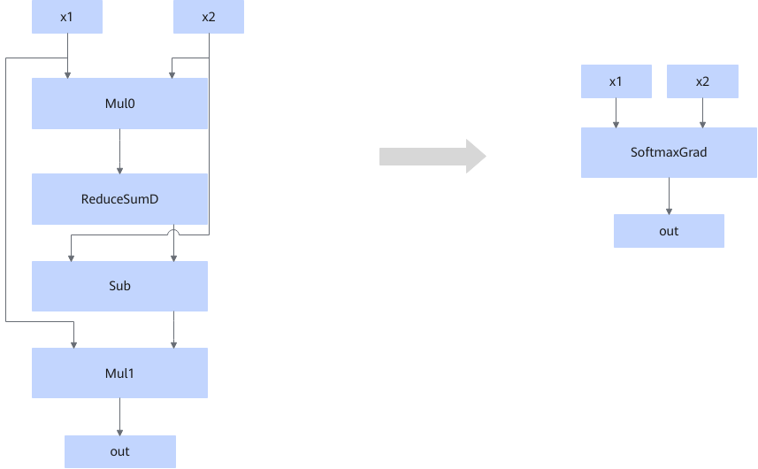
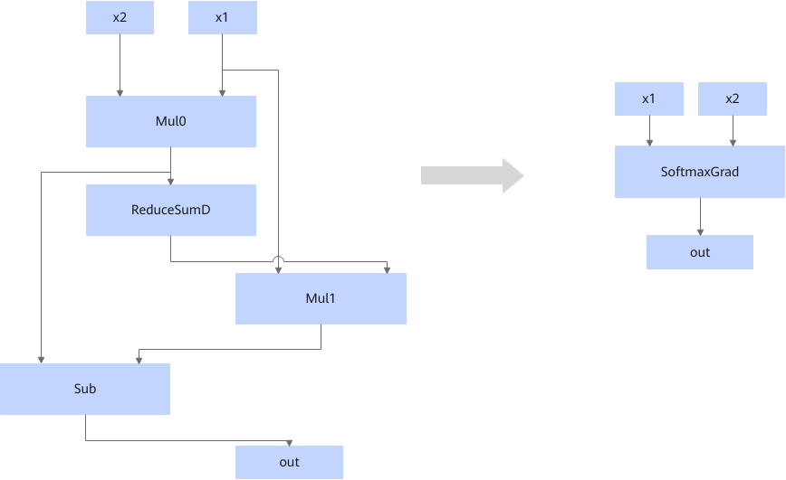

# SoftmaxGradFusionPass

## Description

Fuses small operators that fit the graph fusion pattern into the SoftmaxGrad operator.

- Scenario 1:

- Scenario 2:

## Constraints

- The first inputs of both Mul0 and Mul1 must be the same.
- ReduceSumD can have only one output node.
- The fusion pattern does not take effect if the reduce axis is set to `1` and the AReduceSumFusionPass fusion pattern is enabled.
- In the subgraph of scenario 1:
  - The second input of Mul0 must be the same as the first input of Sub.
  - Mul0 can have only one output node.
  - Sub can have only one output node.

- In the subgraph of scenario 2:
  - The first input of Sub must be the output of Mul0.
  - Mul0 can have only two output nodes.
  - Mul1 can have only one output node.

## Applicable Products

<!-- npu="910b" id1 -->
Atlas A2 training products/Atlas A2 inference products
<!-- end id1 -->
