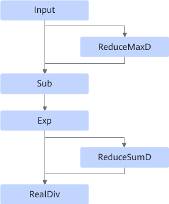
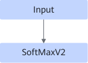

# SoftmaxSmallOpFusionPass

## Description

Identifies and fuses small operators such as ReduceMaxD and Sub into the SoftmaxV2 operator.

Fusion patterns are disabled by default.

Before:  After: 

## Constraints

- Dynamic shapes are not supported.
- For the input parameters of ReduceMaxD and ReduceSumD:
  - `axes` must be the same.
  - `keep_dims` must be `true`.

- The current fusion pattern does not take effect if the reduce axis is set to **1** and AReduceSumFusionPass fusion pattern is enabled.
- The current fusion pattern does not take effect if there is more than one reduce axis and the tail axis is included, the data type is FLOAT32, and ReduceMaxDFusionPass fusion pattern is enabled.
<!-- npu="910b" id2 -->
- Data type constraints:
  - Atlas A2 training products/Atlas A2 inference products: The data type can be FLOAT32, FLOAT16, or BFLOAT16.
<!-- end id2 -->

## Applicable Products

<!-- npu="910b" id1 -->
Atlas A2 training products/Atlas A2 inference products
<!-- end id1 -->
