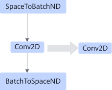

# SpaceToBatchConv2dBatchToSpacePass

## Description

Fuses the SpaceToBatchND, Conv2D, and BatchToSpaceND operators that are sequentially connected into one Conv2D operator.

## Constraints

- SpaceToBatchND/Conv2D/BatchToSpaceND can only have a single output.
- The weight dimension of BatchToSpaceND must be 2, including `block_shape` and `crops`.
- The crops value of BatchToSpaceND must be 0.
- The strides of Conv2D must be `[1, 1, 1, 1]`.
- The pads of Conv2D must be `[0, 0, 0, 0]`.
- The `block_shape` of SpaceToBatchND and BatchToSpaceND must be the same.
- For each dimension: `dilations (Conv2D) x block_shape (BatchToSpaceND) ≤ 255`
- For each dimension: `0 ≤ padding(SpaceToBatchND) ≤ 255`

## Applicable Products

<!-- npu="310p" id1 -->
Atlas inference products
<!-- end id1 -->

<!-- npu="310b" id2 -->
Atlas 200I/500 A2 inference products
<!-- end id2 -->

<!-- npu="910" id3 -->
Atlas training products
<!-- end id3 -->
