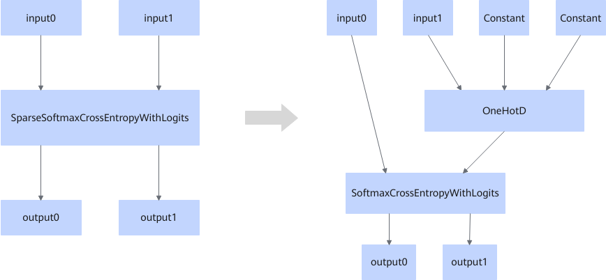

# SparseSoftMaxFusionPass

## Description

Fuses the SparseSoftmaxCrossEntropyWithLogits operator that fits the graph fusion pattern into the OneHotD and SoftmaxCrossEntropyWithLogits operators.

## Constraints

- Dynamic shapes are not supported.
- input0 supports only the float16 and float32 data types.
- input1 supports only the int32 data type.

## Applicable Products

<!-- npu="910b" id1 -->
Atlas A2 training products/Atlas A2 inference products
<!-- end id1 -->
