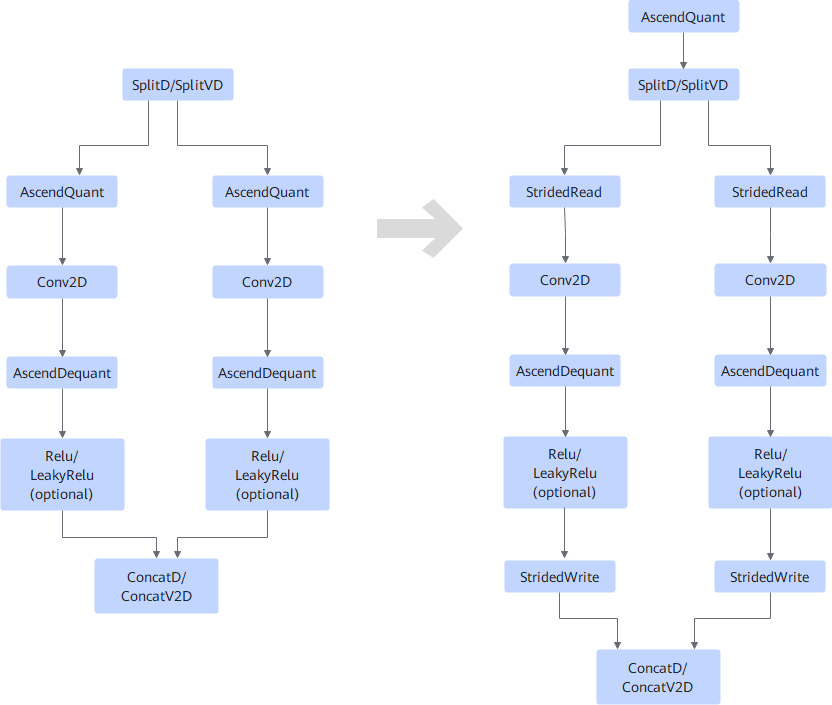
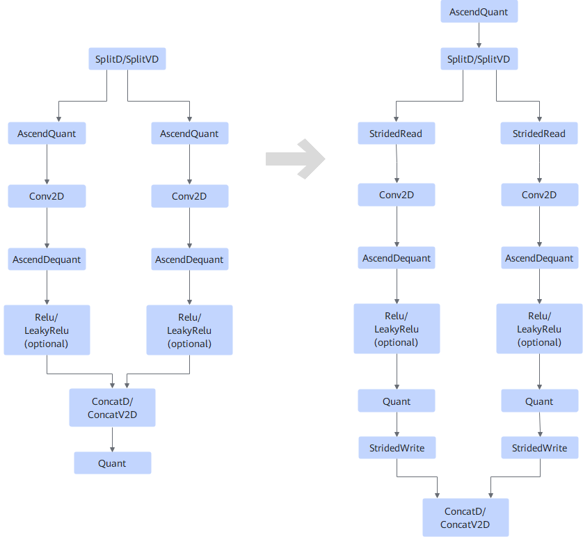
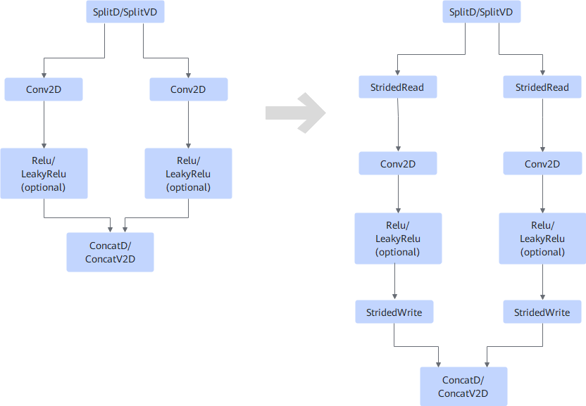
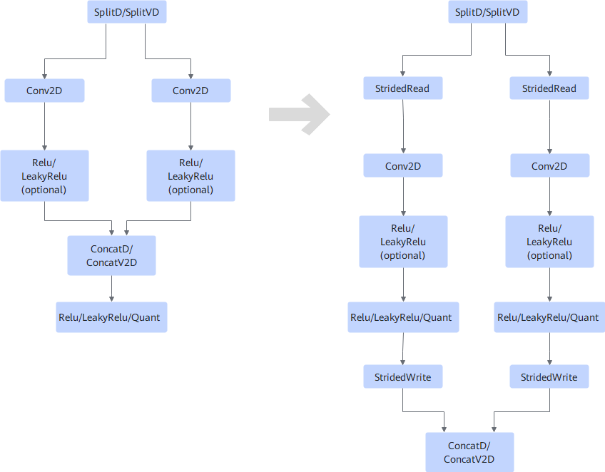
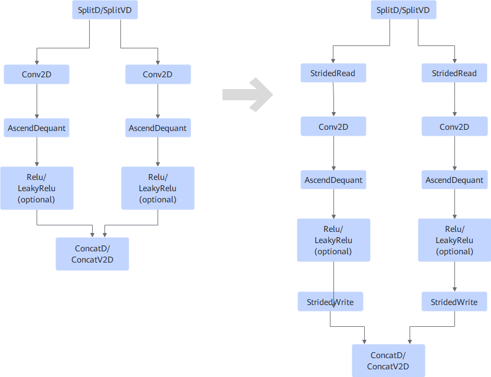
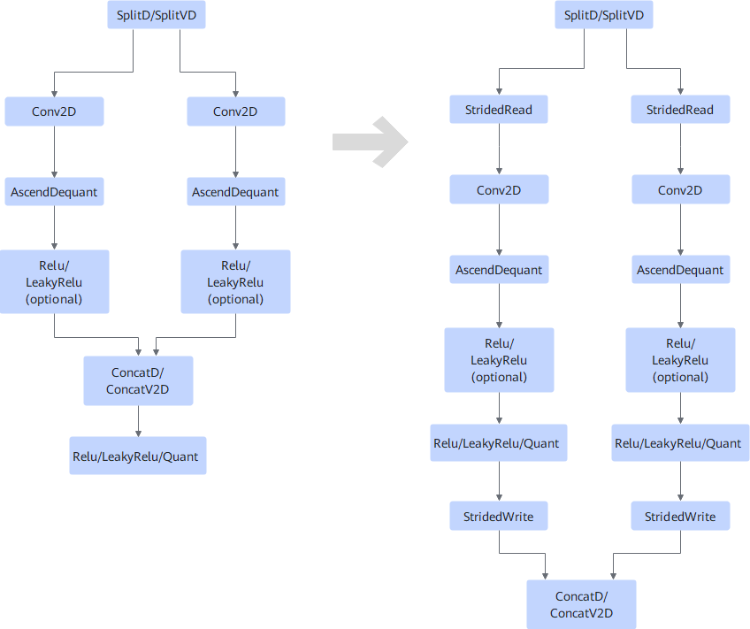

# SplitConvConcatFusionPass

## Description

The following fusion scenarios are supported:

**Scenario 1**

- If the output node of ConcatD/ConcatV2D is not Quant, the fusion scenario is as follows:

    

- If the output node of ConcatD/ConcatV2D is Quant, the fusion scenario is as follows:

    

**Scenario 2**

- If the output node of ConcatD/ConcatV2D is not Relu/LeakyRelu/Quant, the fusion scenario is as follows:

    

- If the output node of ConcatD/ConcatV2D is Relu/LeakyRelu/Quant, the fusion scenario is as follows:

    

**Scenario 3**

- If the output node of ConcatD/ConcatV2D is not Relu/LeakyRelu/Quant, the fusion scenario is as follows:

    

- If the output node of ConcatD/ConcatV2D is Relu/LeakyRelu/Quant, the fusion scenario is as follows:

    

## Constraints

- ConcatD/ConcatV2D has at least two different input nodes.
- The dim axis of SplitD/SplitVD output and ConcatD/ConcatV2D input (except the last input) must be the C axis, and the C axis must be aligned according to data type.
    - If the original dtype is fp16 or float, the value of dim C axis must be a multiple of 16.
    - If the original dtype is int8, the value of dim C axis must be a multiple of 32.
    - If the original dtype is int4, the value of dim C axis must be a multiple of 64.

- All ConcatD/ConcatV2D inputs are 4D and the input format is NCHW or NHWC.
- SplitD/SplitVD has at least two different output nodes.
- The number of input channels of ConcatD/ConcatV2D is the same as the number of output channels of SplitD/SplitVD.
- The AscendQuant operators connected to SplitD/SplitVD must have the same attributes including `scale`, `offset`, and `sqrt_mode`.
- This pass will not apply if any output of ConcatD/ConcatV2D connects to a NETOUTPUT node and its primary or storage format is `FORMAT_NC1HWC0`. This pass will not apply if any output of ConcatD/ConcatV2D feeds into a QUANT, LEAKYRELU, or RELU node, and that node's output in turn connects to a NETOUTPUT node whose primary or storage format is `FORMAT_NC1HWC0`.
- The input of SplitD/SplitVD must not be empty, and its first input node must not be a Data or RefData node.

## Applicable Products

The validity of this pass depends on whether the target product supports the corresponding operator type. For details, see [Ascend IR Operator Specifications](https://www.hiascend.com/document/detail/en/CANNCommunityEdition/latest/API/aolapi/operatorlist_00094.html) in the operator library.
