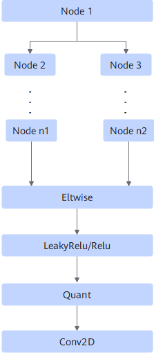
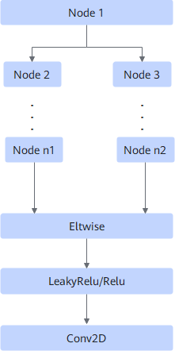
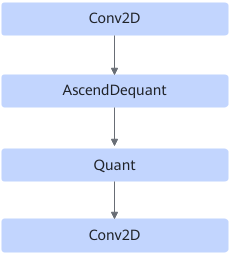
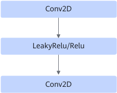
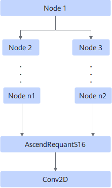

# StrideHoistingPass

## Description

Inserts the ReadSelect operator based on different graph structures. If Conv2D is matched, the shape and attributes of Conv2D are modified. The ultimate goal is to halve the computation workload.

**Scenario 1:**

**Scenario 2:**

**Scenario 3:**

**Scenario 4:**

**Scenario 5:**

## Constraints

- For scenarios 1, 2, and 5:
    - The length of the path from node 1 to node n1 and the length of the path from node 1 to node n2 are both less than 10, and there is at least one Conv2D on the path from node 2 to node n1 or the path from node 3 to node n2. If there is no Conv2D on the path, node 1 must be directly connected to Eltwise/AscendRequantS16. (After the fusion, ReadSelect is inserted between node 1 and Eltwise/AscendRequantS16.) The Conv2D attributes must meet the following requirements:

        **Table 1** Conv2D attribute requirements

        |H and W Dimension Values of the Second Output Filter|H and W Dimension Values in Stride of Operator Description|H and W Dimension Values in Pads of Operator Description|H and W Dimension Values in Dilations of Operator Description|
        |--|--|--|--|
        |3|1|1|1|
        |5|1|2|1|
        |7|1|3|1|

    - All nodes on the path must be in the trustlist, which includes CONV2D, ELTWISE, RELU, LEAKY_RELU, ASCEND_QUANT, ASCEND_DEQUANT, ASCEND_REQUANT, ASCEND_REQUANTS16, and ASCEND_DEQUANTS16.

- For scenarios 3 and 4:
    - The first Conv2D in the figure has a single output.
    - The H and W axes of the first input x of the first Conv2D in the figure are static.

- The attributes of the last Conv2D node in all graphs must meet the following requirements:

    **Table 2** Attributes of the last Conv2D node

    |H and W Dimension Values of the Second Output Filter|H and W Dimension Values in Stride of Operator Description|H and W Dimension Values in Pads of Operator Description|H and W Dimension Values in Dilations of Operator Description|
    |--|--|--|--|
    |1|2|0|1|

## Applicable Products

<!-- npu="310p" id1 -->
Atlas inference products
<!-- end id1 -->

<!-- npu="310b" id2 -->
Atlas 200I/500 A2 inference products
<!-- end id2 -->

<!-- npu="910" id3 -->
Atlas training products
<!-- end id3 -->

<!-- npu="910b" id4 -->
Atlas A2 training products/Atlas A2 inference products
<!-- end id4 -->
