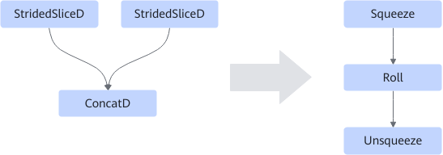

# StridedSliceConcatFusionPass

## Description

Fuses the StridedSliceD/StridedSliceD/ConcatD operator into Squeeze/Roll/Unsqueeze operator to improve the computing performance. See the table below.

This fusion pattern is disabled by default.

## Constraints

The fusion pattern does not take effect when the following conditions are met:

- `concat_dim` is not `1`.
- The inputs of the two StridedSliceD are different.
- The input shape is not 4D.
- The last two dimensions of the input shape are not 32-bit aligned.
- Not all `strides` are `1`.

## Applicable Products

<!-- npu="310p" id1 -->
Atlas inference products
<!-- end id1 -->

<!-- npu="910" id2 -->
Atlas training products
<!-- end id2 -->
