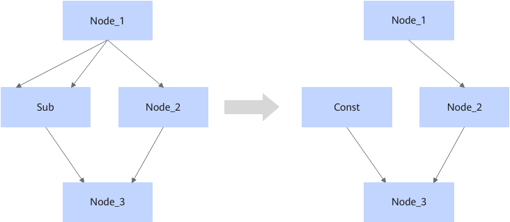

# SubFusionPass

## Description

Fuses the Sub operator that fits the graph fusion pattern into a Const node when the following constraints are met. The Const node's value is set to all zeros, and its shape is consistent with the output shape of the Sub operator.

## Constraints

- The fusion pattern does not take effect when the two inputs of Sub are not from the same output of the same node.
- The fusion pattern does not take effect when the input of Sub has a dynamic shape.
- The fusion pattern does not take effect when the data type of Sub is not float16, float32, uint8, int8, uint16, int16, int32, int64, double, complex64, or complex128.

## Applicable Products

<!-- npu="910b" id1 -->
Atlas A2 training products/Atlas A2 inference products
<!-- end id1 -->
