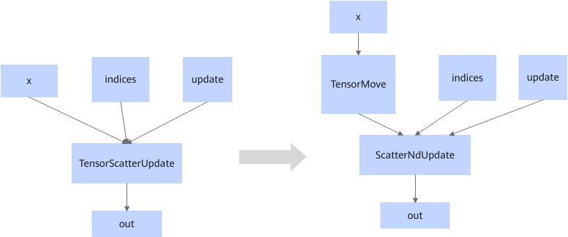

# TensorScatterUpdateFusionPass

## Description

Splits the TensorScatterUpdate operator that fits the graph fusion pattern into the TensorMove and ScatterNdUpdate operators when the input and output data types are not bool or int32.

## Constraints

- This fusion pattern does not take effect when the data type of input x is bool or int32.
- This fusion pattern cannot be disabled.

<!-- npu="950" id3 -->
For 950PR/950DT, the following constraints also apply:

- The ScatterNdUpdate operator AI Core implementation supports the following data types: int64, int8, float32, float16, bfloat16, and bool. Therefore, the fused operator of any of these six data types will be executed on the AI Core, and on the AI CPU if it is of other data types.
- This fusion pattern does not take effect when the data type is String or complex128, since these types are not supported by TensorMove or ScatterNdUpdate.

<!-- end id3 -->
## Applicable Products

<!-- npu="910b" id1 -->
Atlas A2 training products/Atlas A2 inference products
<!-- end id1 -->

<!-- npu="950" id2 -->
950PR/950DT
<!-- end id2 -->
