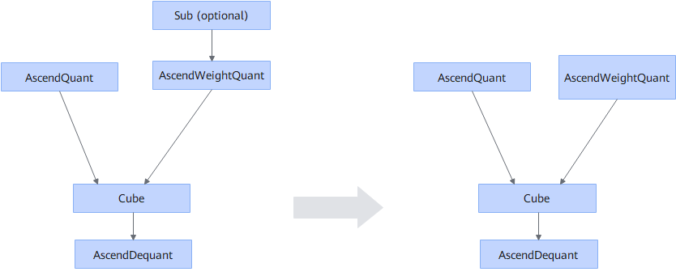
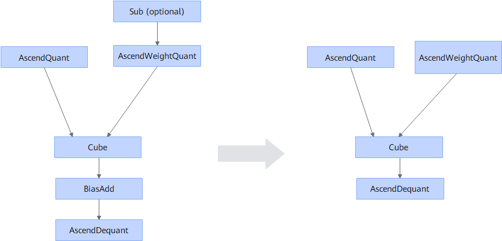
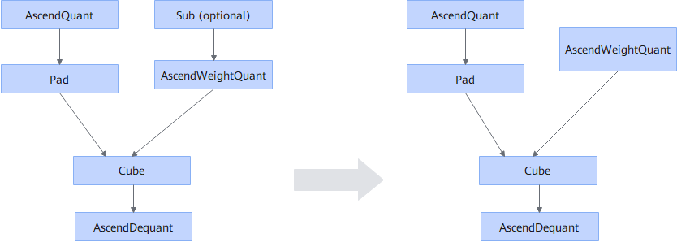
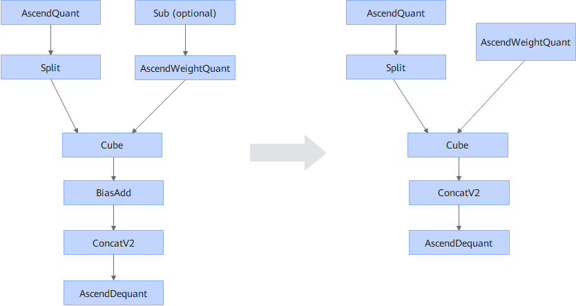
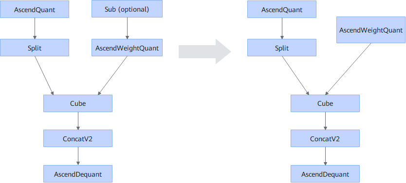
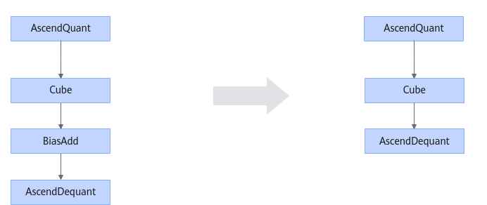

# TfMergeWeightQuantFusionPass

## Description

In quantization use cases, for the matched Cube operators (including Conv2D, DepthwiseConv2D, Conv3D, Deconvolution, Conv2DTransposeD, MatMulV2, and BatchMatMulV2) in the following graph structures, performs the operations shown in the following figures.

If AscendWeightQuant has a Sub input node, fuses Sub.

If AscendWeightQuant does not have a Sub input node, updates the format of AscendWeightQuant to HWCN.

If a Cube operator is followed by a BiasAdd node, fuses the BiasAdd node.

Fusion pattern 1

Fusion pattern 2

Fusion pattern 3

Fusion pattern 4

Fusion pattern 5

Fusion pattern 6

## Constraints

If the fusion condition contains an AscendWeightQuant operator, the AscendWeightQuant operator requires a minimum of two inputs.

The number of outputs of Split must match the number of inputs to Concat, and outputs of Split must be connected to inputs of Concat.

## Applicable Products

<!-- npu="950" id1 -->
950PR/950DT
<!-- end id1 -->
