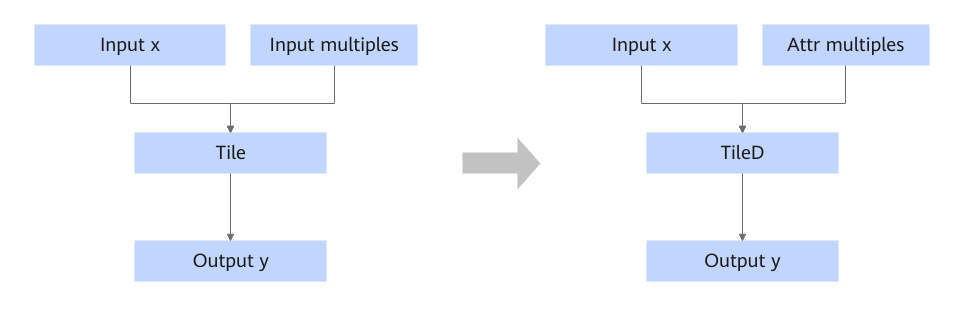

# TileConstToAttrFusion

## Description

Converts Tile into TileD and converts multiple inputs into `required_attr`.

## Constraints

- The data type of the multiple inputs can only be int32 or int64.
- This fusion pattern takes effect only when the dimension of input x is greater than 5, or when the number of elements in multiples is greater than 5.

## Applicable Products

<!-- npu="910b" id1 -->
Atlas A2 training products/Atlas A2 inference products
<!-- end id1 -->

<!-- npu="A3" id2 -->
Atlas A3 training products/Atlas A3 inference products
<!-- end id2 -->

<!-- npu="310p" id3 -->
Atlas inference products
<!-- end id3 -->

<!-- npu="310b" id4 -->
Atlas 200I/500 A2 inference products
<!-- end id4 -->
