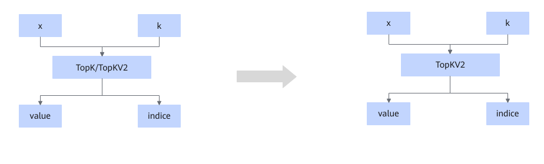
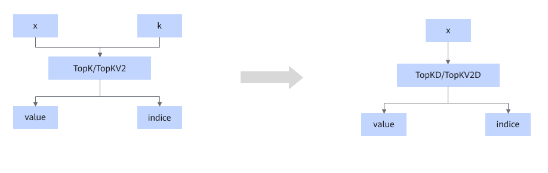
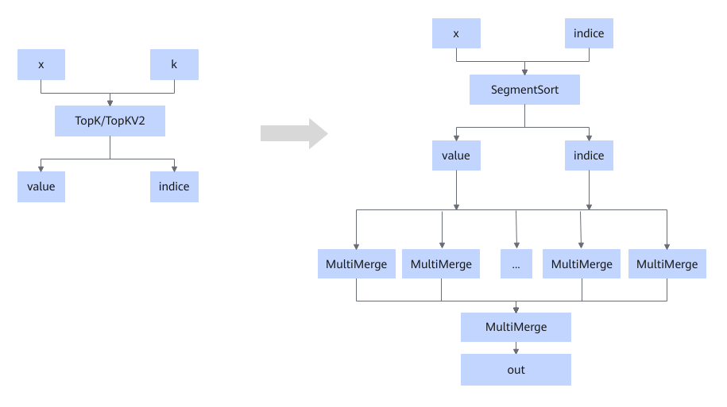

# TopKFusionPass

## Description

Replaces the TopK/TopKV2 operator with the TopKV2 or TopKD/TopKV2D operator based on the platform, or directly splits the TopK/TopKV2 node into the combination of SegmentSort and MultiMerge. Specifically:

Scenario 1: The TopK/TopKV2 operator is replaced with the TopKV2 operator.

Scenario 2: The TopK/TopKV2 operator is replaced with the TopKD/TopKV2D operator.

Scenario 3: The TopK/TopKV2 operator is split into the combination of SegmentSort and MultiMerge.

## Constraints

  <!-- npu="A3,910b,910,310p,310b" id2 -->
- For the following products, the TopK operator does not support `sorted` set to `false`. When the input k is a non-const tensor, TopK/TopKV2 is replaced with TopKV2. When the input k is a const tensor, TopK/TopKV2 is replaced with TopKD/TopKV2D.
  <!-- npu="A3" id3 -->
  - Atlas A3 training products/Atlas A3 inference products
  <!-- end id3 -->
  <!-- npu="910b" id4 -->
  - Atlas A2 training products/Atlas A2 inference products
  <!-- end id4 -->
  <!-- npu="310b" id5 -->
  - Atlas 200I/500 A2 inference products
  <!-- end id5 -->
  <!-- npu="310p" id6 -->
  - Atlas inference products
  <!-- end id6 -->
  <!-- npu="910" id7 -->
  - Atlas training products
  <!-- end id7 -->
  <!-- end id2 -->

<!-- npu="950" id1 -->
- For 950PR/950DT, this fusion pattern cannot be disabled.
- For 950PR/950DT, the TopK/TopKV2 operator is replaced with the TopKV2 operator.
<!-- end id1 -->

## Applicable Products

The validity of this pass depends on whether the running product supports the TopK/TopKV2 operator type. For details, see [Ascend IR Operator Specifications](https://www.hiascend.com/document/detail/en/CANNCommunityEdition/latest/API/aolapi/operatorlist_00094.html) in the operator library.
