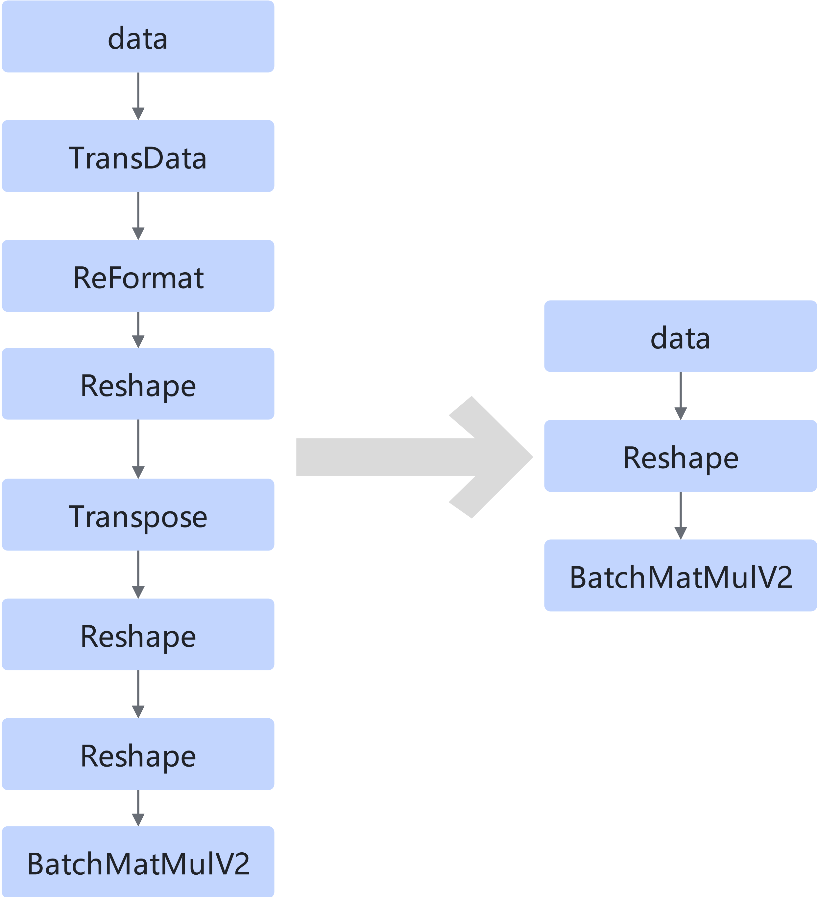
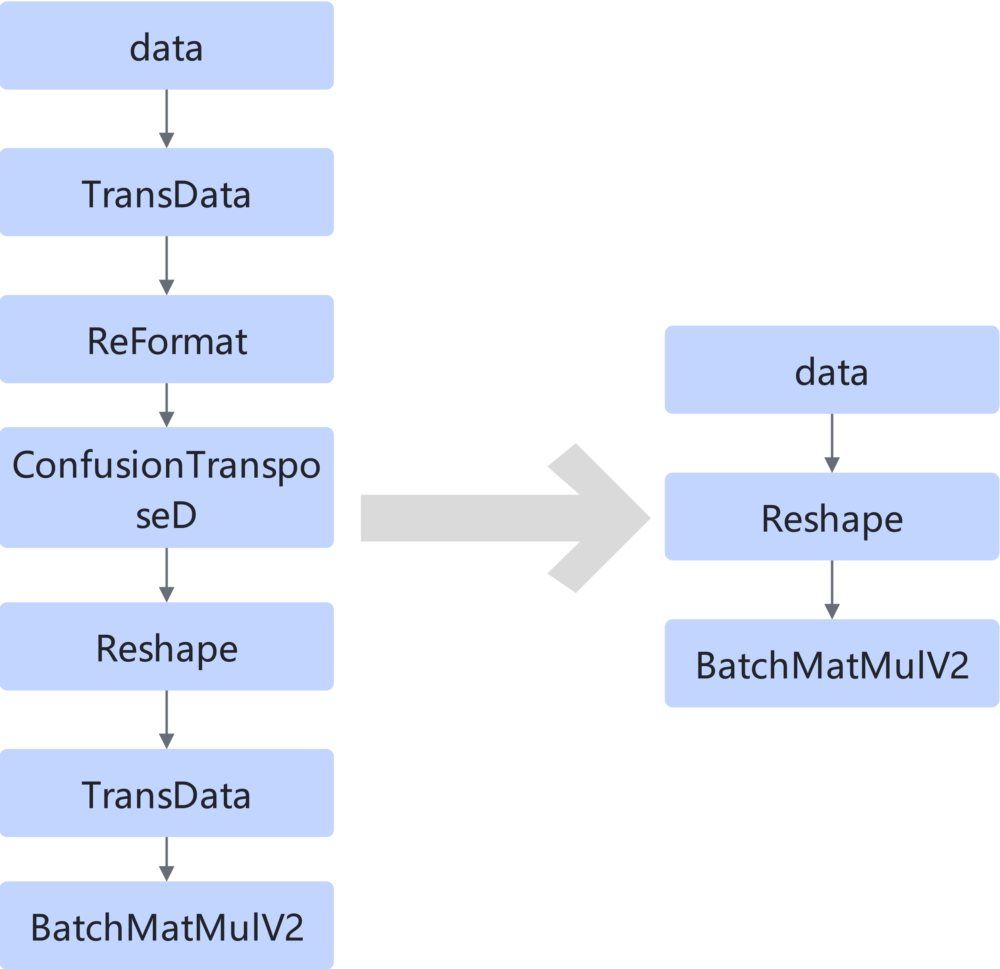
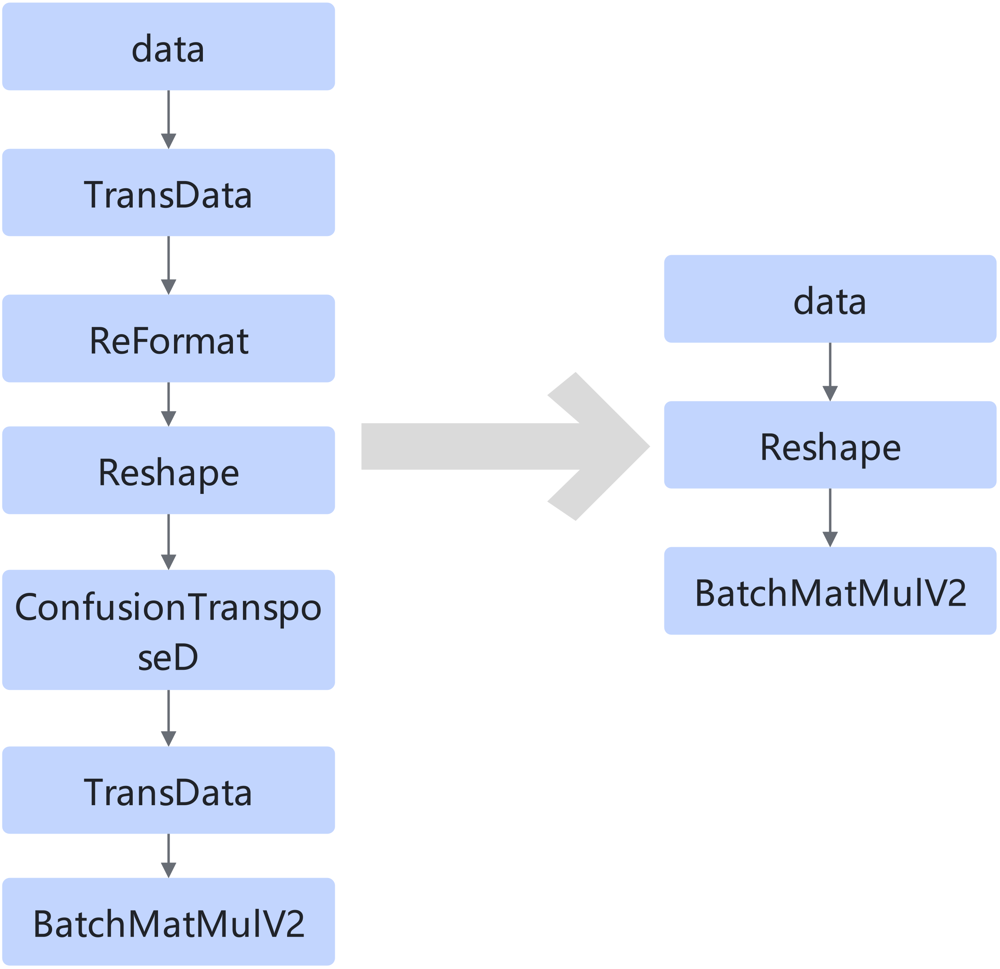

# TransdataTransposeTransdataBatchMatMulv2FusionPass

## Description

Deletes redundant nodes such as TransData and Transpose between the two BatchMatMulV2 nodes.

Pattern 1:

Pattern 2:

Pattern 3:

## Constraints

The output data type of the first TransData must be float16.

All nodes can only be referenced once.

The perm list of Transpose can only be `[0,2,1,3]`, and the last dimension must be exactly divided by 16.

The last three dimensions of the input shape of the first TransData must be the same as those of the output shape of the second TransData.

## Applicable Products

<!-- npu="310p" id1 -->
Atlas inference products
<!-- end id1 -->
