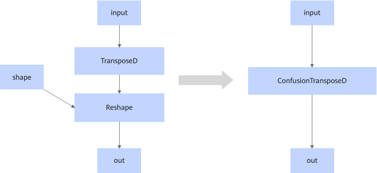

# TransposeReshapeFusionPass

## Description

Fuses the TransposeD and Reshape operators that fit the graph fusion pattern into the ConfusionTransposeD operator.

## Constraints

- The fusion pattern does not take effect when the input shape of TransposeD or the output shape of Reshape is empty.
- The fusion pattern does not take effect when the input of TransposeD or the output of Reshape has a dynamic shape.
- The fusion pattern does not take effect when the output shape of Reshape is 1-dimensional and its size is not divisible by 16.
- The fusion pattern does not take effect when the output shape of Reshape has two or more dimensions and at least one of the last two dimensions of the output shape is not divisible by 16.
- The fusion pattern does not take effect when the input shape of TransposeD is 1D and its size is not divisible by 16.
- The fusion pattern does not take effect when the input shape of TransposeD has two or more dimensions and at least one of the last two dimensions of the input shape is not divisible by 16.
- The fusion pattern does not take effect when the data type is not supported by the fused operator.

## Applicable Products

<!-- npu="910b" id1 -->
Atlas A2 training products/Atlas A2 inference products
<!-- end id1 -->
