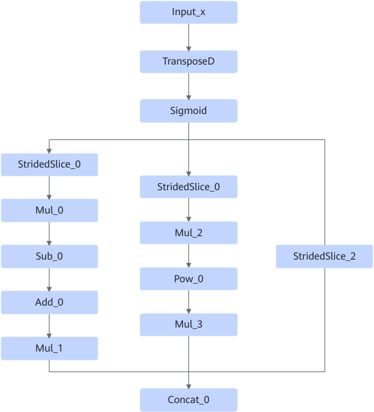
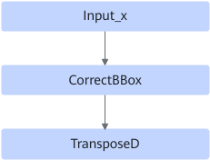
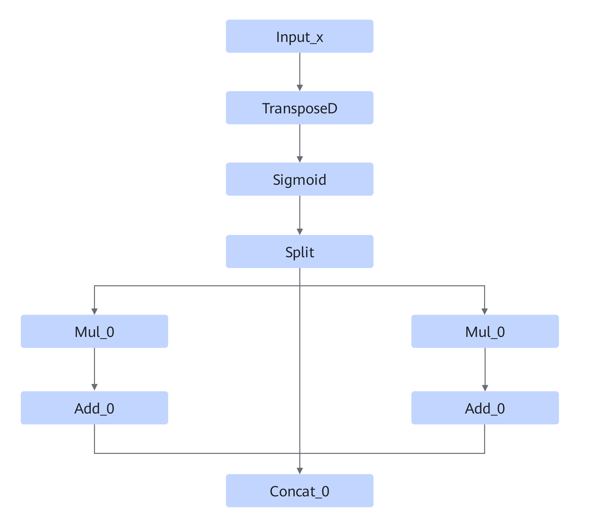

# TransposeSigmoidMulAddPowConcatFusionPass

## Description

Fuses the sigmoid structures of yolov3, yolov5, and yolov7 models which have no NMS postprocessing operator into one operator.

**Pattern 1**

After:

**Pattern 2**

After:

## Constraints

None

## Applicable Products

<!-- npu="310p" id1 -->
Atlas inference products
<!-- end id1 -->
