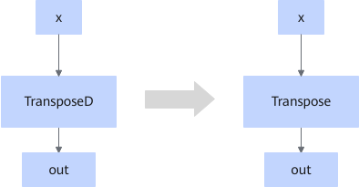

# TransposedUpdateFusionPass

## Description

Changes the TransposeD operator in the graph that fits the graph fusion pattern to the Transpose operator when the `check_supported` function in the TransposeD operator returns `True`.

## Constraints

- Fusion is performed when `check_supported` returns `True`.
- This fusion pattern cannot be disabled.

## Applicable Products

<!-- npu="910b" id1 -->
Atlas A2 training products/Atlas A2 inference products
<!-- end id1 -->
