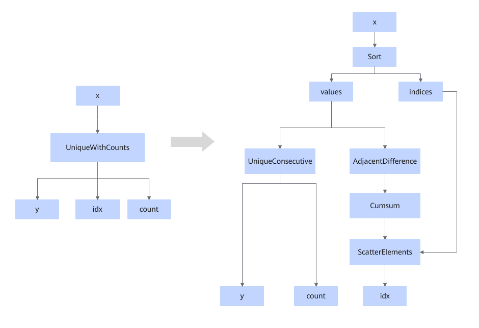
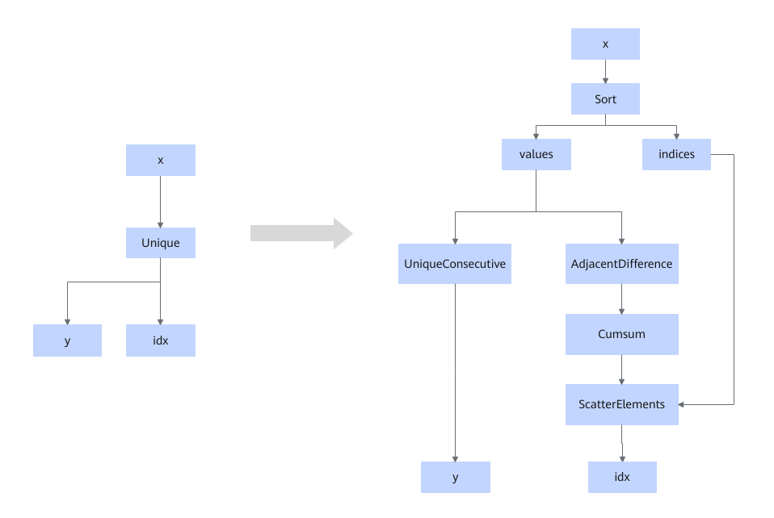

# UniqueSortFusionPass

## Description

Splits the Unique or UniqueWithCount operator into a combination of Sort+AdjacentDifference+Cumsum+Scatter+UniqueConsecutive operators to complete the computation.

The Unique or UniqueWithCount operator before splitting is an AI CPU operator, and the five operators (Sort, AdjacentDifference, Cumsum, Scatter, and UniqueConsecutive) after splitting are all AI Core operators.

Scenario 1:

Scenario 2:

## Constraints

- The output data types of idx and count are int32 and int64.
- The data types of the input x can be int64, int32, int16, int8, uint64, uint32, uint16, uint8, bfloat16, float16, and float32.
<!-- npu="950" id2 -->
- For 950PR/950DT, this fusion pattern cannot be disabled.
<!-- end id2 -->

## Applicable Products

<!-- npu="950" id1 -->
950PR/950DT
<!-- end id1 -->
