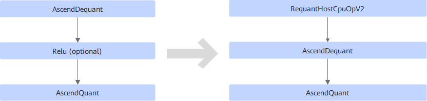
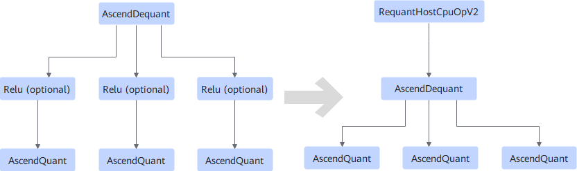
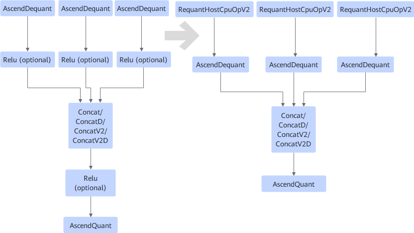

# V100RequantFusionPass

## Description

Optimizes the quantization nodes in inference tasks.

Inserts the RequantHostCpuOpV2 operator into the input of AscendDequant based on the following structures.

- **Scenario 1**

  

- **Scenario 2**

  

- **Scenario 3**

  

## Constraints

If there are multiple AscendDequant operators, the scale values of all AscendDequant operators must be the same.

## Applicable Products

<!-- npu="310p" id1 -->
Atlas inference products
<!-- end id1 -->
