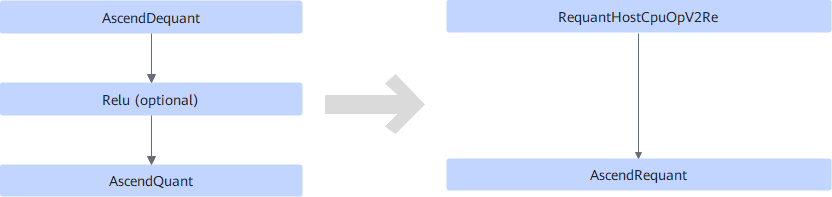
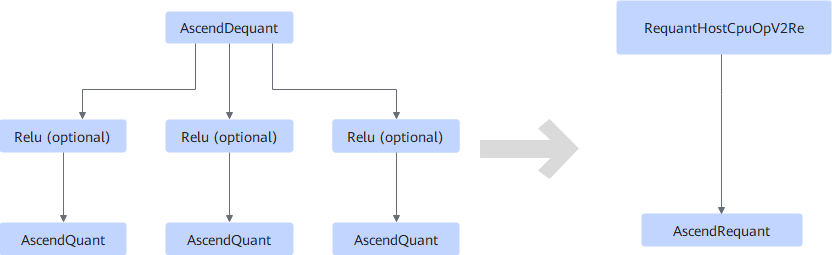
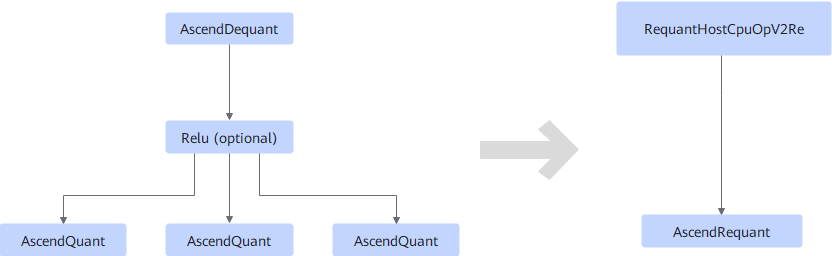
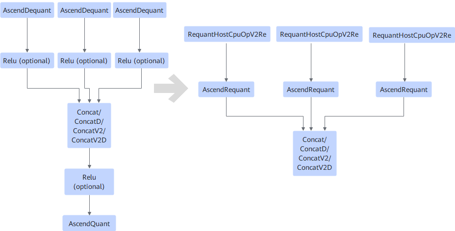

# V200RequantFusionPass

## Description

Optimizes the quantization nodes in inference tasks.

Based on the following structures, fuses AscendDequant and AscendQuant into AscendRequant, and inserts the RequantHostCpuOpV2Re operator into the input of AscendDequant.

- **Scenario 1**

  

- **Scenario 2**

  

- **Scenario 3**

  

- **Scenario 4**

  

## Constraints

This pattern is mainly used to fuse dequantization operators during inference on a quantized model.

Ascend Model Compression Toolkit (AMCT) will insert quantization and dequantization operators when quantizing the original model, while ATC will fuse the inserted operators during model conversion. In this case, to perform accuracy comparison between the quantized model and the original one, you must disable the fusion pattern. For details, see [Disabling/Enabling Fusion Patterns](../Introduction.md).

In addition, there are the following constraints:

- If there are multiple AscendQuant operators, the scale values of all AscendQuant operators must be the same.
- The dim axis of Concat/ConcatD/ConcatV2/ConcatV2D must be the C axis, and the C axis must be aligned according to the data type.
  - If the original dtype is fp16 or float, the value of dim C must be a multiple of 16.
  - If the original dtype is int8, the value of dim C must be a multiple of 32.
  - If the original dtype is int4, the value of dim C must be a multiple of 64.

## Applicable Products

<!-- npu="310p" id1 -->
Atlas inference products
<!-- end id1 -->
