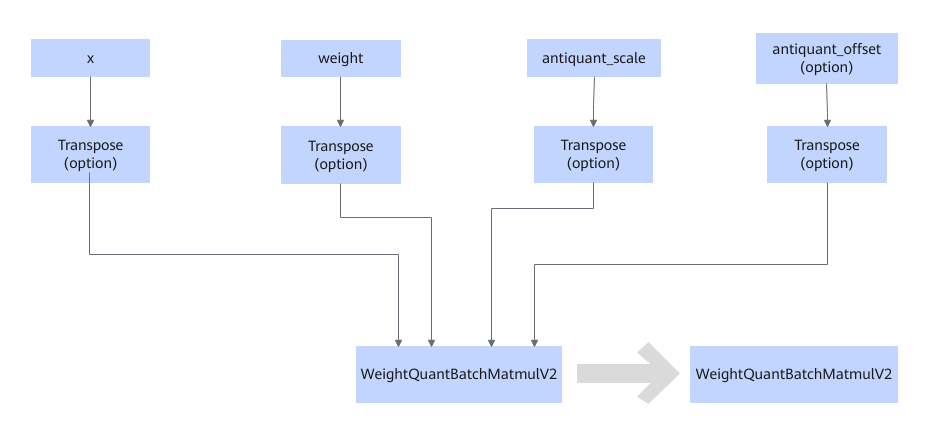

# WeightQuantBatchMatmulV2TransposeFusionPass

## Description

Offloads information about the Transpose nodes connected to WeightQuantBatchMatmulV2 to the `transpose_x` and `transpose_weight` attributes.

## Constraints

- The Transpose nodes connected to `antiquant_scale` and `antiquant_offset` can be processed only when the weight node is connected to the Transpose node.
- This fusion pattern is mandatory. Disabling it will result in functional errors.

## Applicable Products

<!-- npu="910b" id1 -->
Atlas A2 training products/Atlas A2 inference products
<!-- end id1 -->

<!-- npu="A3" id2 -->
Atlas A3 training products/Atlas A3 inference products
<!-- end id2 -->

<!-- npu="950" id3 -->
950PR/950DT
<!-- end id3 -->
