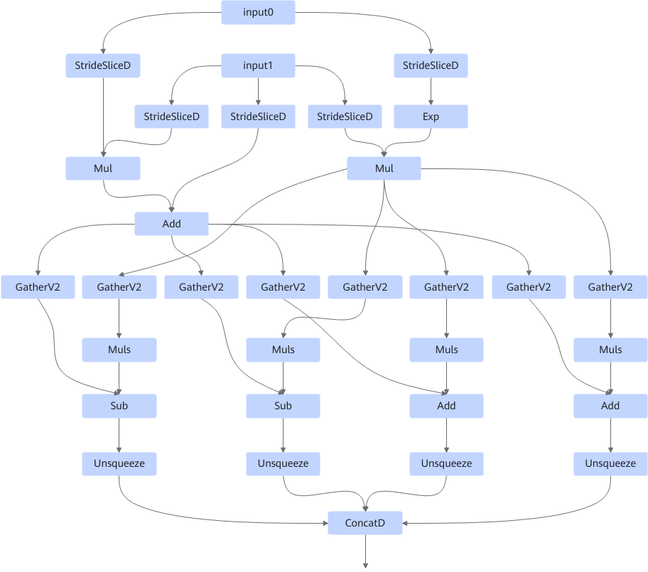
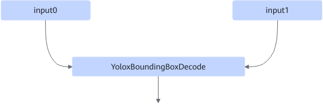

# YoloxBoundingBoxDecodeONNXFusionPass

## Description

Fuses the StridedSliceD, Mul, Exp, GatherV2, Add, Muls, Sub, Unsqueeze, and ConcatD operators into YoloxBoundingBoxDecode, to improve the computing performance.

After:

## Constraints

None

## Applicable Products

<!-- npu="310p" id1 -->
Atlas inference products
<!-- end id1 -->
