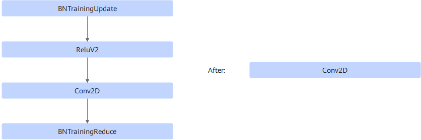

# ZBNupdateReluV2Conv2DBNreducePass

## Description

Fuses the BNTrainingUpdate+ReluV2+Conv2D+BNTrainingReduce operators into one Conv2D operator to improve computing performance.

## Constraints

The Conv2D node with bias is not supported.

## Applicable Products

<!-- npu="910" id1 -->
Atlas training products
<!-- end id1 -->
