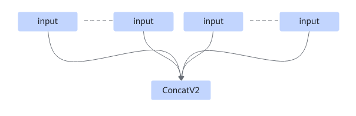
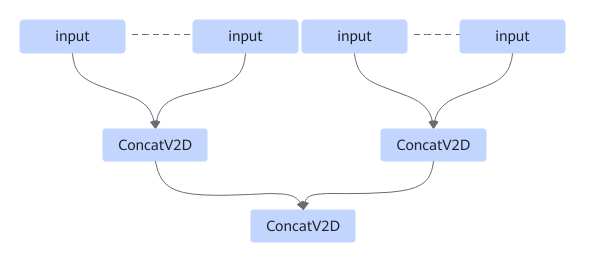

# ZConcatExt2FusionPass

## Description

Splits the ConcatV2 operator with multiple inputs into multiple ConcatV2D operators. The number of ConcatV2D operators after fusion is determined based on the actual number of inputs according to a predefined calculation rule.

After:

## Constraints

- For static shapes, the maximum number of inputs compiled for a single ConcatV2 operator is 63.
- For dynamic shapes, the maximum number of inputs compiled for a single ConcatV2 operator is 48.
- In binary use cases, the maximum number of inputs compiled for a single ConcatV2 operator is 32.
- The input data type cannot be complex64, complex128, or double.
- This fusion pattern cannot be disabled by default.

## Applicable Products

<!-- npu="910b" id1 -->
Atlas A2 training products/Atlas A2 inference products
<!-- end id1 -->
