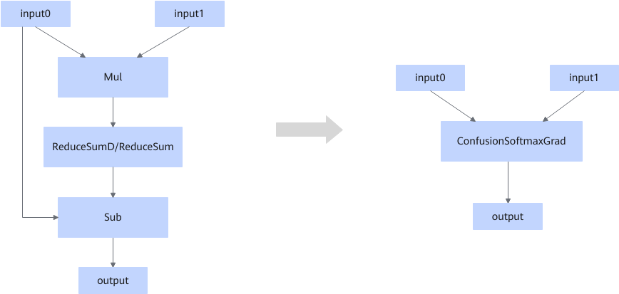

# ZConfusionSoftmaxGradFusionPass

## Description

Fuses the Mul, ReduceSumD/ReduceSum (supported only by 950PR/950DT), and Sub operators that match the pattern into the ConfusionSoftmaxGrad operator.

## Constraints

- The fusion pattern does not take effect for dynamic shapes.
- The fusion pattern does not take effect when the two inputs of the Mul operator have different shapes.
- The fusion pattern does not take effect when the input0 of the Mul operator and the input0 of the Sub operator are from different nodes.
- The fusion pattern does not take effect when input0 is not the first input of the Sub operator.
- This fusion pattern does not take effect when the `axis` attribute of ReduceSumD/ReduceSum is not the tail axis index of the input shape.
- This fusion pattern does not take effect when the last axis of the input shape for ReduceSumD/ReduceSum is greater than 30000.
- The fusion pattern does not take effect when the data type is not supported by the fused operator.
- The data type and format of input0 must be the same as those of input1.
- The fusion pattern does not take effect if the reduce axis is set to `1` and the AReduceSumFusionPass fusion pattern is enabled.
- For 950PR/950DT, if `keep_dims` of ReduceSum is `False`, this fusion pattern does not take effect.
- For 950PR/950DT, if the input axis of ReduceSum is not a const node, this fusion pattern does not take effect.

## Applicable Products

<!-- npu="910b" id3 -->
Atlas A2 training products/Atlas A2 inference products
<!-- end id3 -->

<!-- npu="950" id2 -->
950PR/950DT
<!-- end id2 -->
