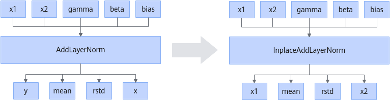

# ZInplaceAddLayerNormFusionPass

## Description

Reuses the input address *x1* of AddLayerNorm as the output address *y*, input address *x2* as the output address *x*, and converts the operator to InplaceAddLayerNorm.

## Constraints

- The input types of the AddLayerNorm operator cannot be different before fusion.
- AddLayerNorm does not support being called as a custom operator integrated into a graph.

## Applicable Products

<!-- npu="910b" id1 -->
Atlas A2 training products/Atlas A2 inference products
<!-- end id1 -->

<!-- npu="A3" id2 -->
Atlas A3 training products/Atlas A3 inference products
<!-- end id2 -->
