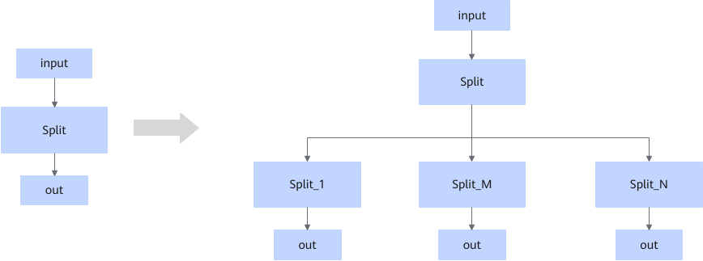
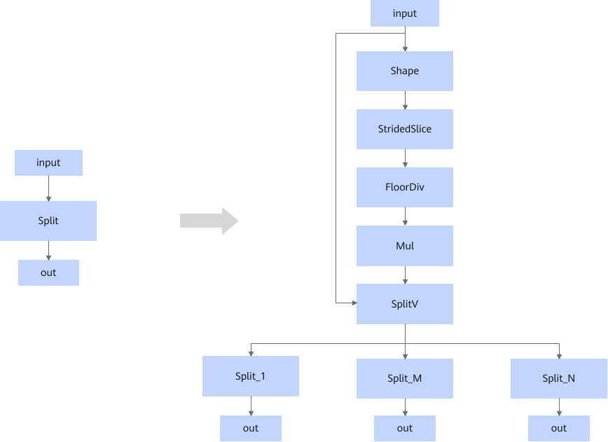

# ZSplitFusionPassV2

## Description

Decomposes a Split node with output count exceeding the limit into a hierarchical cascade of Split/SplitV nodes.

Even decomposition

Uneven decomposition

## Constraints

- This fusion pattern takes effect when `num_split` of Split exceeds the maximum output limit.
- This fusion pattern cannot be disabled.

## Applicable Products

<!-- npu="910b" id1 -->
Atlas A2 training products/Atlas A2 inference products
<!-- end id1 -->
