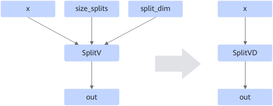

# ZSplitVDFusionPassV2

## Description

When `size_splits` and `split_dim` of SplitV are constants, fuses SplitV into SplitVD and removes the `size_splits` and `split_dim` nodes to improve operator performance.

## Constraints

None

## Applicable Products

<!-- npu="310p" id1 -->
Atlas inference products
<!-- end id1 -->

<!-- npu="310b" id2 -->
Atlas 200I/500 A2 inference products
<!-- end id2 -->

<!-- npu="910" id3 -->
Atlas training products
<!-- end id3 -->

<!-- npu="910b" id4 -->
Atlas A2 training products/Atlas A2 inference products
<!-- end id4 -->

<!-- npu="A3" id5 -->
Atlas A3 training products/Atlas A3 inference products
<!-- end id5 -->
