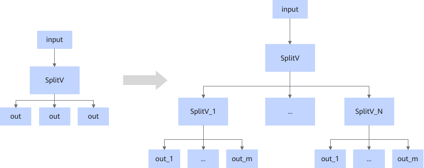
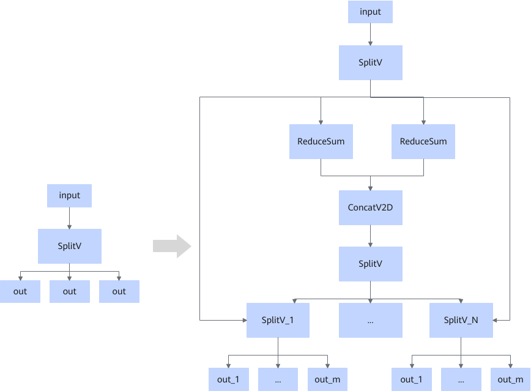

# ZSplitVFusionPass

## Description

Decomposes a SplitV node with output count exceeding the limit into a hierarchical cascade of SplitV nodes.

Fusion pattern when the `size_splits` input is a constant:

Fusion pattern when the `size_splits` input is not a constant:

## Constraints

- This fusion pattern takes effect when `num_split` exceeds the maximum output limit. The SplitV node is split into a multi-layer cascaded SplitV node structure.
- If `num_split` does not exceed the maximum output limit, this fusion pattern does not take effect, and the original SplitV node structure is retained.
- This fusion pattern cannot be disabled.

## Applicable Products

<!-- npu="910b" id1 -->
Atlas A2 training products/Atlas A2 inference products
<!-- end id1 -->
