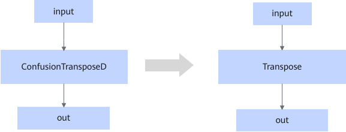

# ZZConfusionTransposeNdFusionPass

## Description

Replaces the ConfusionTransposeD operator in the ND format with the Transpose operator in static scenarios.

## Constraints

- The input and output formats must be ND.
- Only static shapes are supported.
- The value of the `perm` attribute must be within the range of `[0, input rank]`.

## Applicable Products

<!-- npu="910b" id1 -->
Atlas A2 training products/Atlas A2 inference products
<!-- end id1 -->
