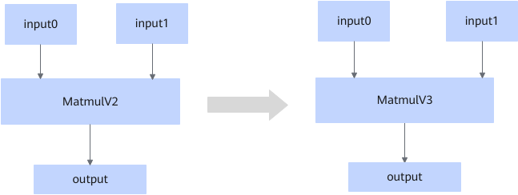

# ZZMatMulToMatmulV3FusionPass

## Description

Converts the MatmulV2 operator that fits the graph fusion pattern into the MatmulV3 operator.

## Constraints

The fusion pattern does not take effect if any of the following conditions are met:

- The platform does not support l0c2out or out2l1_nd2nz, but supports l0c2ub and fix_pipe_l0c2ub.
- Any input or output dimension is below 2, the shape is dynamic, and the input or output data type is not float16, bfloat16, or float32.

## Applicable Products

<!-- npu="910b" id1 -->
Atlas A2 training products/Atlas A2 inference products
<!-- end id1 -->
