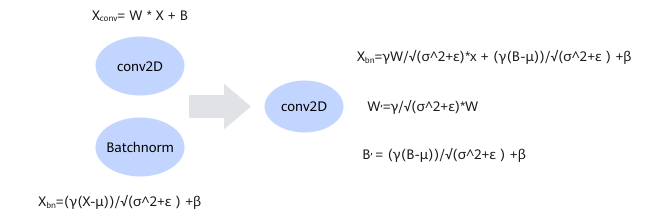
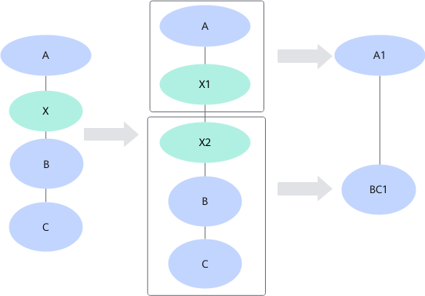

# Introduction

## Overview

Operator fusion, an important means to improve network performance, can be implemented by graph fusion or Unified Buffer fusion (UB fusion).

Graph fusion is a key method to improve network performance.

The system has a range of built-in graph fusion and UB fusion patterns, which are enabled by default and can be disabled. (If any pattern is disabled by default, special description will be provided.) This document describes only part of the fusion patterns.

>[!NOTE]
>For details about the operators involved in this document, see [Ascend IR Operator Specifications](https://www.hiascend.com/document/detail/en/CANNCommunityEdition/latest/API/aolapi/operatorlist_00094.html) in the operator library.

## Graph Fusion

Operator performance can be improved with hardware-agnostic fusion strategies when a network model is built using graphs.

Graph fusion refers to the process of modifying a graph according to the fusion patterns. The base operators in the graph are replaced by fused operators to improve the compute efficiency. Graph fusion improves the operator compute efficiency from the following aspects:

- Saves the compute time by reducing the mathematical computation workload of operators. For example, Conv and BiasAdd can be fused into one operator, so that accumulation is directly completed in the L0C Buffer to spare the Add computation workload.
- Accelerates post-fusion computation by utilizing hardware instructions. In the preceding example, graph fusion is performed to move the accumulation workload of "Conv+BiasAdd" structure to the L0C Buffer, thereby accelerating the computation process by utilizing the accumulation capability of L0C Buffer.

Graph fusion includes fusion of individual graphs and fusion of partitioned subgraphs.

- Graph fusion: Mathematical fusion is performed on operators in a graph to fuse operators into one or more operators, which is hardware irrelevant.

    As shown in Figure 1, the Conv2D and Batchnorm operators are fused into Conv2D after mathematical calculation.

    **Figure 1** Direct graph fusion
    

- Fusion after split: Splits an operator into multiple operators and fuses the split operators with other operators.

    As shown in Figure 2, operator X is split into operators X1 and X2. X1 is fused with A to form A1, and X2 is fused with B and C to form BC1.

    **Figure 2** Fusion after split
    

## UB Fusion

Operator performance can be improved with hardware-relevant fusion strategies when a network model is built using graphs, for example, performing UB fusion at graph build time.

UB refers to the unified buffer on an AI processor. UB fusion is to perform hardware UB-related fusion on operators in a graph. Assume that two operators are running independently and the computation result of operator 1 is stored in UB and needs to be moved to the DDR. To run operator 2, the output of operator 1 needs to be moved from the DDR back to UB. After the compute process of operator 2 is complete, the output of operator 1 is moved from UB back to the DDR.

The result of operator 1 is moved in the following sequence: UB -> DDR -> UB -> DDR. The process of data movement passing by DDR is unnecessary. Therefore, operators 1 and 2 can be fused into one operator. After fusion, the output of operator 1 is retained in the UB so that operator 2 can directly obtain data from UB for computation. In this way, the performance is improved by saving one DDR read transaction and one DDR write transaction.

## Enabling/Disabling Fusion Patterns

You can choose to enable/disable some of the fusion patterns in advance before building a model as needed to improve the build performance. However, enabling/disabling fusion patterns does not mean better computing performance. The method is as follows:

- When converting a model with ATC, use `--fusion_switch_file` to configure the directory and name of the fusion switch file. Example:

    ```bash
    --fusion_switch_file=/home/fusion_switch.cfg
    ```

- When building an IR model, use `FUSION_SWITCH_FILE` to configure the directory and name of the fusion switch file. Example:

    ```c++
    std::map<AscendString, AscendString> global_options = {
            {ge::ir_option::FUSION_SWITCH_FILE, "/home/fusion_switch.cfg"},
        };
    auto status = aclgrphBuildInitialize(global_options);
    ```

- During model training and online inference, use `fusion_switch_file` to configure the directory and name of the fusion switch file. Example:

    ```bash
    custom_op.parameter_map["fusion_switch_file"].s = tf.compat.as_bytes("/home/fusion_switch.cfg")
    ```

The `fusion_switch.cfg` file passed in the example is for reference only, which needs to be created and named by yourself. The following shows the content example, in which `on` indicates that a fusion pattern is enabled, and `off` otherwise.

```json
{
    "Switch":{
        "GraphFusion":{
            "ConvToFullyConnectionFusionPass":"on",
            "SoftmaxFusionPass":"on",
            "ConvConcatFusionPass":"on",
            "MatMulBiasAddFusionPass":"on",
            "PoolingFusionPass":"on",
            "ZConcatv2dFusionPass":"on",
            "ZConcatExt2FusionPass":"on"
        },
        "UBFusion":{
            "FusionVirtualOpSetSwitch":"on"
        }
    }
}
```

You can disable fusion patterns with a few clicks. To disable all fusion patterns at a time, refer to the following example:

```json
{
    "Switch":{
        "GraphFusion":{
            "ALL":"off"
        },
        "UBFusion":{
            "ALL":"off"
         }
    }
}
```

Note:

1. Even the preceding example disables only part of built-in fusion patterns, because disabling certain patterns may lead to functionality problems.
2. The fusion patterns in this document are enabled by default. Therefore, the one-click configuration `"ALL":"on"` is invalid.
3. You can disable all fusion patterns except selected ones. (That is, the priority of a single fusion pattern configured in the configuration file can be higher than that of `"ALL"`.)

    ```json
    {
        "Switch":{
            "GraphFusion":{
                "ALL":"off",
                "SoftmaxFusionPass":"on"
            },
            "UBFusion":{
                "ALL":"off",
                "FusionVirtualOpSetSwitch":"on"
            }
        }
    }
    ```

## Checking the Execution Order of Fusion Patterns

After a model is executed, you can check the execution order of fusion patterns in logs. The procedure is as follows:

1. Go to the log flush path.

    The default path is `$HOME/ascend/log/debug/plog/`. You can specify the path by using `ASCEND_PROCESS_LOG_PATH`. For details, see [Log Reference](https://www.hiascend.com/document/detail/en/CANNCommunityEdition/latest/maintenref/logreference/docs/zh/log_ref/log_overview.md).

    **cd $HOME/ascend/log/debug/plog/**

2. Check the graph fusion pattern that has taken effect.

    **cat \* | grep "GraphId" | grep -v "effected\_times=0" | grep "effected\_times="**

    The following is an example of the command output. `effected_times` indicates the number of times that the graph fusion pattern takes effect.

    ```text
    [INFO] GE(3675829,atc.bin):2025-04-10-20:10:58.288.365 [pattern_fusion_base_pass.cc:259]3675829 RunOnePattern:GraphId[0], GraphFusionPass[TfTagNoConstFoldingFusionPass]: pattern=tfTagNoConstFoldingFusion1, matched_times=2, effected_times=2.
    [INFO] GE(3675829,atc.bin):2025-04-10-20:10:58.409.757 [pattern_fusion_base_pass.cc:259]3675829 RunOnePattern:GraphId[0], GraphFusionPass[TfMergeWeightQuantFusionPass]: pattern=tfMergeWeightQuantFusion0, matched_times=2, effected_times=2.
    [INFO] GE(3675829,atc.bin):2025-04-10-20:10:58.909.250 [pattern_fusion_base_pass.cc:259]3675829 RunOnePattern:GraphId[0], GraphFusionPass[Conv2DQuantProcessFusionPass]: pattern=Conv2DQuantProcessFusion, matched_times=2, effected_times=2.
    [INFO] GE(3675829,atc.bin):2025-04-10-20:10:58.910.555 [pattern_fusion_base_pass.cc:259]3675829 RunOnePattern:GraphId[0], GraphFusionPass[V200NotRequantFusionPass]: pattern=notRequantPassPattern1, matched_times=2, effected_times=2.
    [INFO] GE(3675829,atc.bin):2025-04-10-20:10:58.910.644 [pattern_fusion_base_pass.cc:259]3675829 RunOnePattern:GraphId[0], GraphFusionPass[V200NotRequantFusionPass]: pattern=notRequantPassPattern2, matched_times=2, effected_times=2.
    [INFO] GE(3675829,atc.bin):2025-04-10-20:10:58.910.782 [pattern_fusion_base_pass.cc:259]3675829 RunOnePattern:GraphId[0], GraphFusionPass[DeleteNoConstFolding]: pattern=deleteNoConstFoldingFusion0, matched_times=2, effected_times=2.
    [INFO] GE(3675829,atc.bin):2025-04-10-20:10:58.940.829 [pattern_fusion_base_pass.cc:259]3675829 RunOnePattern:GraphId[0], GraphFusionPass[ZConcatExt2FusionPass]: pattern=ConcatExt2FusionPass, matched_times=1, effected_times=1.
    [INFO] GE(3675829,atc.bin):2025-04-10-20:10:58.943.310 [pattern_fusion_base_pass.cc:259]3675829 RunOnePattern:GraphId[0], GraphFusionPass[ZSplitVDFusionPassV2]: pattern=SplitVDFusionPassV2, matched_times=1, effected_times=1.
    [INFO] GE(3675829,atc.bin):2025-04-10-20:10:58.943.398 [pattern_fusion_base_pass.cc:259]3675829 RunOnePattern:GraphId[0], GraphFusionPass[ZSplitVDFusionPass]: pattern=SplitVDFusionPass, matched_times=1, effected_times=1.
    [INFO] GE(3675829,atc.bin):2025-04-10-20:10:58.946.086 [pattern_fusion_base_pass.cc:259]3675829 RunOnePattern:GraphId[0], GraphFusionPass[SplitConvConcatFusionPass]: pattern=SplitConvConcatFusionPass, matched_times=1, effected_times=1.
    [INFO] GE(3675829,atc.bin):2025-04-10-20:10:59.079.485 [pattern_fusion_base_pass.cc:259]3675829 RunOnePattern:GraphId[0], GraphFusionPass[FixPipeAbilityProcessPass]: pattern=FixPipeAbilityProcessPass, matched_times=2, effected_times=2.
    ```

    >[!NOTE]
    >- The fusion pattern order printed in the log is the actual execution order.
    >- You can also run `cat * | grep "GraphId" | grep "effected_times="` to check all matched graph fusion patterns.

3. Check the execution order of UB fusion patterns.

    **cat \* |grep "Run buffer fusion pass successfully, pass name"**

    An example of the command output is shown below. The fusion pattern order printed in the log is the actual execution order. Check the `fusion_result.json` file to see whether the fusion patterns have taken effect.

    ```text
    [INFO] FE(2018559,tc_ge_irrun_static_ifa_0003.bin):2025-06-09-09:55:36.632.602 [buffer_fusion.cc:135]2018968 RunRegisterBufferFusionPass:"Run buffer fusion pass successfully, pass name:TbeAippConvReluMaxpoolingFusion."
    [INFO] FE(2018559,tc_ge_irrun_static_ifa_0003.bin):2025-06-09-09:55:36.632.761 [buffer_fusion.cc:135]2018968 RunRegisterBufferFusionPass:"Run buffer fusion pass successfully, pass name:TbeAippConv2dAddRelu6MulMulFusionPass."
    [INFO] FE(2018559,tc_ge_irrun_static_ifa_0003.bin):2025-06-09-09:55:36.632.803 [buffer_fusion.cc:135]2018968 RunRegisterBufferFusionPass:"Run buffer fusion pass successfully, pass name:BatchMatmulV2DequantMulAddFusionPass."
    [INFO] FE(2018559,tc_ge_irrun_static_ifa_0003.bin):2025-06-09-09:55:36.632.854 [buffer_fusion.cc:135]2018968 RunRegisterBufferFusionPass:"Run buffer fusion pass successfully, pass name:TbeBatchMatmulQuantFusionPass."
    [INFO] FE(2018559,tc_ge_irrun_static_ifa_0003.bin):2025-06-09-09:55:36.632.957 [buffer_fusion.cc:135]2018968 RunRegisterBufferFusionPass:"Run buffer fusion pass successfully, pass name:TbeFullyconnectionElemwiseDequantFusionPass."
    [INFO] FE(2018559,tc_ge_irrun_static_ifa_0003.bin):2025-06-09-09:55:36.632.988 [buffer_fusion.cc:135]2018968 RunRegisterBufferFusionPass:"Run buffer fusion pass successfully, pass name:TbeFifoMatMulFusionPass."
    [INFO] FE(2018559,tc_ge_irrun_static_ifa_0003.bin):2025-06-09-09:55:36.633.036 [buffer_fusion.cc:135]2018968 RunRegisterBufferFusionPass:"Run buffer fusion pass successfully, pass name:TbeMatmulFixPipeFusionPass."
    [INFO] FE(2018559,tc_ge_irrun_static_ifa_0003.bin):2025-06-09-09:55:36.633.075 [buffer_fusion.cc:135]2018968 RunRegisterBufferFusionPass:"Run buffer fusion pass successfully, pass name:ATbeMatmulElemwiseFusionPass."
    [INFO] FE(2018559,tc_ge_irrun_static_ifa_0003.bin):2025-06-09-09:55:36.633.100 [buffer_fusion.cc:135]2018968 RunRegisterBufferFusionPass:"Run buffer fusion pass successfully, pass name:BatchMatmulConfusiontransposeUbFusion."
    ```
