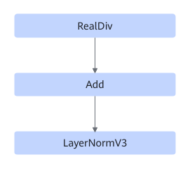
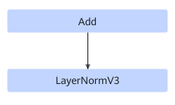

# AddLayerNormV3FusionPass 

## Description

Performs UB fusion on the RealDiv+Add+LayerNormV3 structure or the Add+LayerNormV3 structure.

Or

## Constraints

- This pattern applies only to the static scenarios of the Atlas inference accelerator cards with the ND data format.
- This pattern applies only to the scenario where the last axis of LayerNormV3 is 320, 640, 768, 1024, 1280, or 1536.

## Applicable Products

<!-- npu="310p" id1 -->
Atlas inference products
<!-- end id1 -->
