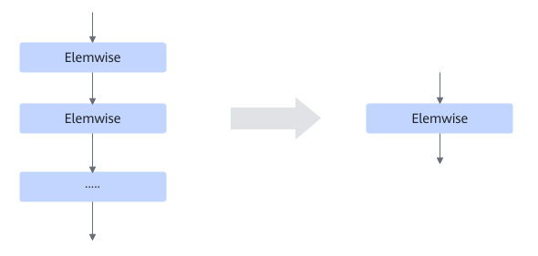

# AutomaticUbFusion

## Description

Performs UB fusion on connected Elemwise operators that have not been involved in UB fusion. The fusion priority is the lowest.

## Constraints

- A maximum of 29 Elemwise operators can be fused.
- Operators that have been matched by other UB fusion patterns cannot be involved in the fusion.
- The AddN operator with more than six inputs cannot be involved in the fusion.
