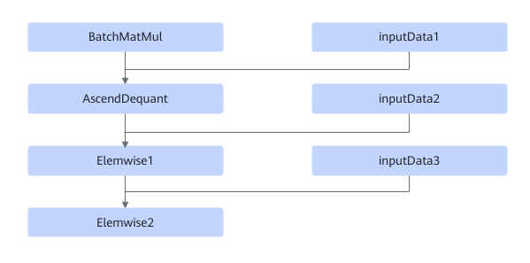

# BatchMatMulV2DequantMulAddFusionPass

## Description

Performs UB fusion on the BatchMatMul+Elemwise+AscendDequant nodes in a subgraph that meets the following pattern:

## Constraints

In the preceding figure, the BatchMatMul, Elemwise1, and Elemwise2 nodes are operator types. The BatchMatMul node includes the BatchMatMul and BatchMatmulV2 operators, and the Elemwise1 node is Mul, the Elemwise2 node is Add.

## Applicable Products

<!-- npu="310b" id1 -->
Atlas 200I/500 A2 inference products
<!-- end id1 -->

<!-- npu="310p" id2 -->
Atlas inference products
<!-- end id2 -->

<!-- npu="910" id3 -->
Atlas training products
<!-- end id3 -->
