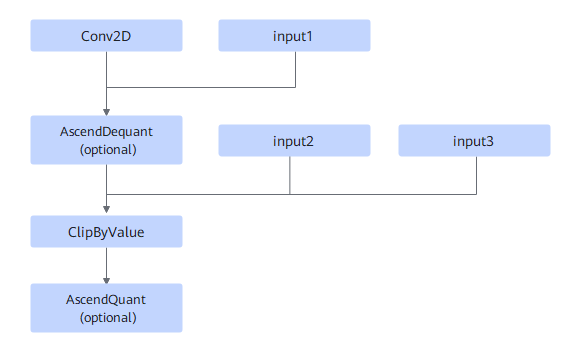
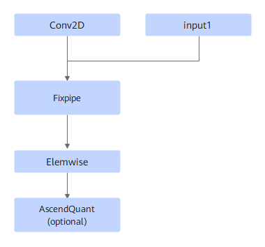

# Conv2DDequantClipByValueFusionPass

## Description

Fuses the Conv2D+AscendDequant (optional)+ClipByValue+AscendQuant (optional) operators into one operator.

Or

## Constraints

For the second pattern structure, the number of Elemwise operators is 1 to 3. The first Elemwise operator must be of the ClipByValue type, and the last two Elemwise operators must be of the Relu or Add type.

The number of the input channels of the ClipByValue operator must be an integer multiple of 16.

## Applicable Products

<!-- npu="310b" id1 -->
Atlas 200I/500 A2 inference products
<!-- end id1 -->

<!-- npu="310p" id2 -->
Atlas inference products
<!-- end id2 -->

<!-- npu="910" id3 -->
Atlas training products
<!-- end id3 -->
