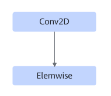

# ConvClipByValueFusionPass

## Description

The following fusion pattern is supported:

Fuses the Conv2D+Elemwise (ClipByValue type) operators into one operator.

## Constraints

- The number of Elemwise operators is 1 to 3. The first Elemwise operator must be of the ClipByValue type, and the last two Elemwise operators must be of the Relu or Add type.
- The number of the output channels of the Conv2D operator must be an integer multiple of 16.

## Applicable Products

<!-- npu="310b" id1 -->
Atlas 200I/500 A2 inference products
<!-- end id1 -->

<!-- npu="310p" id2 -->
Atlas inference products
<!-- end id2 -->

<!-- npu="910" id3 -->
Atlas training products
<!-- end id3 -->
