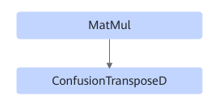

# MatmulConfusiontransposeUbFusion

## Description

Performs UB fusion on MatMul and ConfusionTransposeD in the subgraph that meets the following pattern.

## Constraints

Dynamic shapes are not supported.
