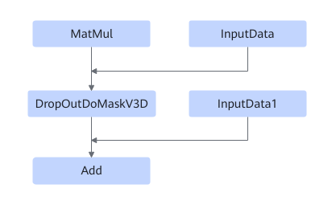

# MatmulDropOutDoMaskV3DFusionPass

## Description

Performs UB fusion on MatMul and DropOutDoMaskV3D/Add in the following pattern subgraph.

## Constraints

- MatMul must be the MatMulV2 operator.
- Dynamic shapes are not supported.

## Applicable Products

<!-- npu="310b" id1 -->
Atlas 200I/500 A2 inference products
<!-- end id1 -->

<!-- npu="310p" id2 -->
Atlas inference products
<!-- end id2 -->

<!-- npu="910" id3 -->
Atlas training products
<!-- end id3 -->
