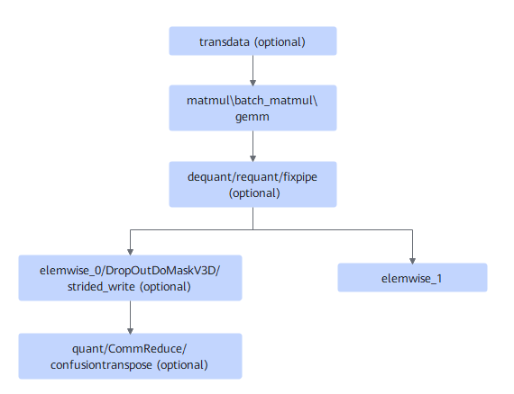
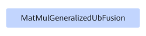

# MatmulGeneralizedUbFusion

## Description

Performs UB fusion on the subgraphs that match the following fusion pattern.

After:

## Constraints

None.

## Applicable Products

<!-- npu="310p" id1 -->
Atlas inference products
<!-- end id1 -->

<!-- npu="310b" id2 -->
Atlas 200I/500 A2 inference products
<!-- end id2 -->

<!-- npu="910" id3 -->
Atlas training products
<!-- end id3 -->
