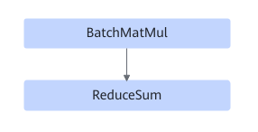

# MatmulReduceSumUbFusion

## Description

Performs UB fusion on BatchMatMul and ReduceSum in a subgraph that meets the following pattern.

## Constraints

- The input of BatchMatMul is not 1, and the output is 1D.
- The output of ReduceSum is of type float32, and `keep_dim` is `false`.
- BatchMatMul and BatchMatMulV2 are supported.
- The shape of the BatchMatMul input data cannot exceed three dimensions. In addition, dimension 0 of the input data cannot be 1 and cannot exceed the maximum value of `uint16_t` when there are three dimensions.

## Applicable Products

<!-- npu="310b" id1 -->
Atlas 200I/500 A2 inference products
<!-- end id1 -->

<!-- npu="310p" id2 -->
Atlas inference products
<!-- end id2 -->

<!-- npu="910" id3 -->
Atlas training products
<!-- end id3 -->
