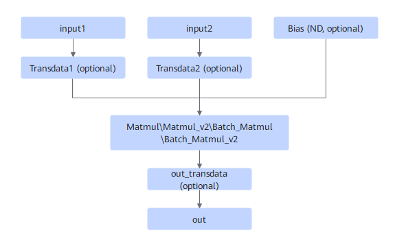
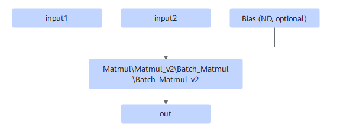

# MatmulTransdataFusionPass

## Description

Performs UB fusion on the subgraphs that match the following fusion pattern.

After:

## Constraints

- At least two inputs are required. Bias is optional. Data must be in ND format.
- The input of Transdata1 and Transdata2 is ND, and the output is NZ. The input of `out_transdata` is NZ, and the output is ND.
- Static and non-alignment scenarios are not supported.
- Only fp16 input and fp16 output are supported.

## Applicable Products

<!-- npu="310p" id1 -->
Atlas inference products
<!-- end id1 -->

<!-- npu="310b" id2 -->
Atlas 200I/500 A2 inference products
<!-- end id2 -->

<!-- npu="910" id3 -->
Atlas training products
<!-- end id3 -->
