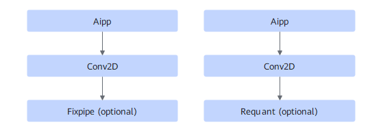

# TbeAippCommonFusionPass

## Description

Performs UB fusion on the Aipp+Conv2D+Fixpipe (optional) or Requant (optional) nodes in a subgraph that meets the following pattern.

At most one Fixpipe or Requant is supported.

## Constraints

- Fusion is disabled for the Conv2D operator with `strides = [1, 1]`, `pad = [0, 0, 0, 0]`, and `kernel 1x1`.
- Fusion is disabled when Aipp resizing is enabled.
- Fusion is disabled when the Aipp mode is `dynamic`.
- Fusion is disabled when the Aipp input format is set to one of `["RGB16", "RGB20", "RGB24","RGB8_IR", "RGB16_IR","RGB24_IR"]`.
- Fusion is disabled when Aipp padding is enabled.
- Fusion is not supported if DMA is enabled for the Conv2D operator.
- Fusion is canceled if the minimum tiling is provided and L1 still cannot accommodate the Aipp processing result.
- Fusion is canceled if the convolutional kernel height is less than or equal to the sum of the values of Conv2d pad and AIPP pad in either the upper or lower direction.

## Applicable Products

<!-- npu="310b" id1 -->
Atlas 200I/500 A2 inference products
<!-- end id1 -->

<!-- npu="310p" id2 -->
Atlas inference products
<!-- end id2 -->

<!-- npu="910" id3 -->
Atlas training products
<!-- end id3 -->
