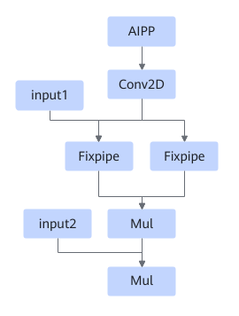
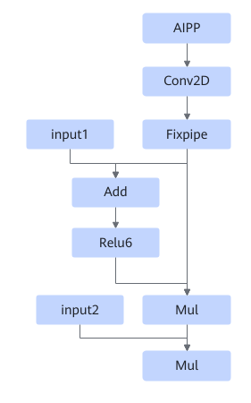
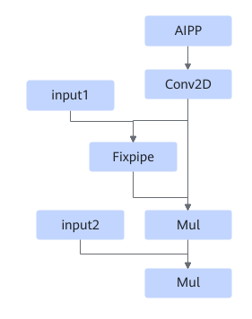
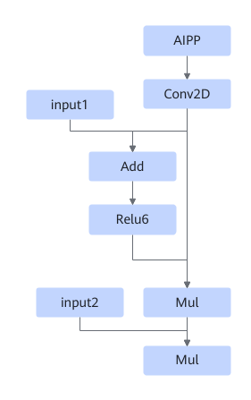
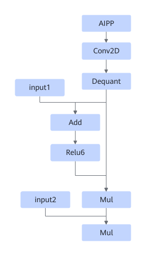

# TbeAippConv2dAddRelu6MulMulFusionPass

## Description

Fuses any structure that matches the following patterns into a single fused operator.

Or

Or

Or

Or

## Constraints

- For a Conv2D operator, fusion is disabled when `strides` is `[1, 1]`, `pad` is `[0, 0, 0, 0]`, and `kernel` is `1 x 1`.
- Fusion is disabled when AIPP resizing is enabled.
- Fusion is disabled when the AIPP mode is `dynamic`.
- Fusion is disabled when AIPP padding is enabled.
- If DMA is enabled for the Conv2D operator, fusion is not supported.
- Fusion is canceled if the minimum tiling is provided and L1 still cannot accommodate the AIPP processing result.
- Fusion is canceled if the convolutional kernel height is less than or equal to the sum of the values of Conv2d pad and AIPP pad in either the upper or lower direction.

## Applicable Products

<!-- npu="310p" id1 -->
Atlas inference products
<!-- end id1 -->

<!-- npu="310b" id2 -->
Atlas 200I/500 A2 inference products
<!-- end id2 -->

<!-- npu="910" id3 -->
Atlas training products
<!-- end id3 -->
