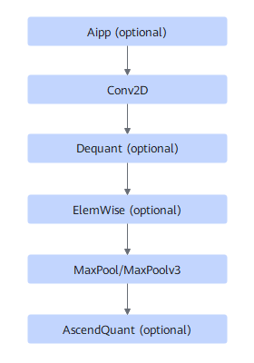

# TbeAippConvReluMaxpoolingFusion

## Description

Fuses the Aipp (optional)+Conv2D+Dequant (optional)+ElemWise (optional)+MaxPool (MaxPool/Pooling/MaxPoolv3)+AscendQuant (optional) operators in the following pattern subgraph into one operator.

## Constraints

Fusion can be performed only when the following conditions are met:

- Conv2D: Small channel is enabled. The `kernel` size must be 3 x 3, 5 x 5, or 7 x 7, `strides` must be `[1, 1]` or `[2, 2]`, and `cout` must be less than or equal to 64.
- MaxPool: strides = [2, 2], ksize = [2, 2]/[3, 3].
- When MaxPool `ksize` is [2, 2] and the Conv2D input width is greater than 1000, this fusion pattern is disabled.
- When MaxPool `ksize` is [3, 3] and the Conv2D input width is greater than 800, this fusion pattern is disabled.
- Pooling: strides = [2, 2], window= [2, 2]/[3, 3].
- When the pooling window is [2, 2] and the Conv2D input width is greater than 1000, this fusion pattern is disabled.
- When the pooling window is [3, 3] and the Conv2D input width is greater than 800, this fusion pattern is disabled.

<!-- npu="310p" id1 -->
Fusion can be performed only when Maxpoolv3 meets the following conditions:

- SoC: Atlas inference accelerator card
- Conv2D:

    (1) The input format is NCHW.

    (2) The shape of `fmap` is [N,3,224,224], where N is any valid input.

    (3) The shape of `filter` is [N,3,7,7], where N ranges from 1 to 96.

    (3) The shape of `pads` is [3,3,3,3].

    (4) The shape of `strides` is [N,N,2,2], where N is any valid input.

    (5) The shape of `dilations` is [N,N,1,1], where N is any valid input.

    (6) The value of `groups` is `1`.

- maxpoolv3:

    (1) The input format is NCHW.

    (2) The shape of `strides` is [N,N,2,2], where N is any valid input.

    (3) The shape of `ksize` is [N,N,3,3], where N is any valid input.

    (4) `padding_mode` is `CALCULATED`.

    (5) The shape of `pads` is [1,1,1,1].

    (6) `global_pooling` is `false`.

    (7) `ceil_mode` is `false`.

- Aipp: C04 enabled
- Elemwise: Only Relu and LeakyRelu are supported.
<!-- end id1 -->

## Applicable Products

<!-- npu="310b" id2 -->
Atlas 200I/500 A2 inference products
<!-- end id2 -->
<!-- npu="310p" id3 -->
Atlas inference products
<!-- end id3 -->
<!-- npu="910" id4 -->
Atlas training products
<!-- end id4 -->